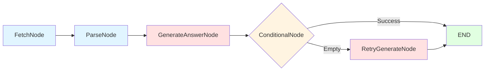
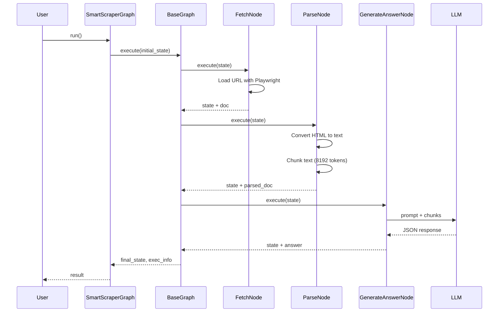
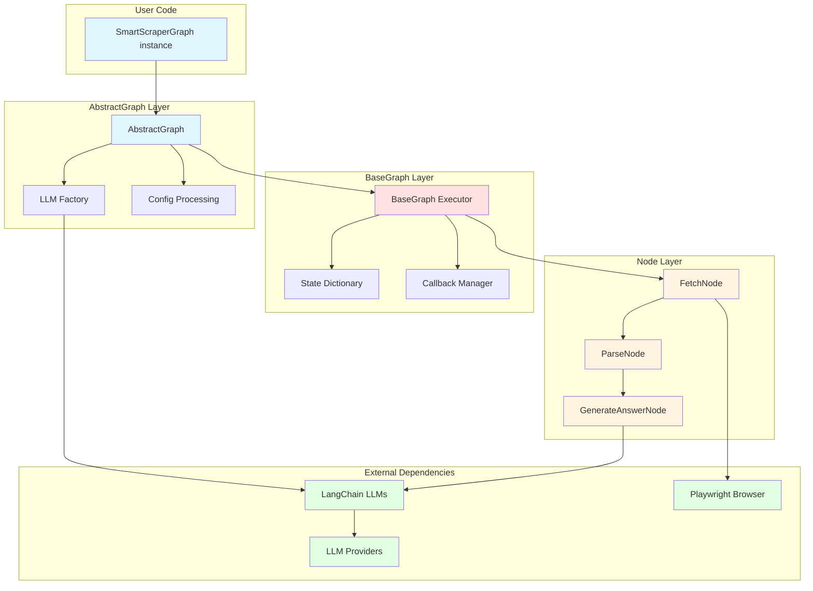

# Understanding ScrapeGraphAI: Architecture and Core Concepts

**Analysis Based on Commit:** [32d5636ac3465edd0a8af47c6242f16a0beb35f5](https://github.com/ScrapeGraphAI/Scrapegraph-ai/commit/32d5636ac3465edd0a8af47c6242f16a0beb35f5)
**Read Time:** 10 minutes | **Difficulty:** Beginner-Intermediate
**Part 1 of the ScrapeGraphAI Technical Blog Series**

---

## Introduction: Why LLM-Based Scraping Matters

Web scraping has always been a brittle art. You write a selector like `div.product-card > h2.title`, deploy your scraper, and three weeks later the website redesigns and your scraper breaks. You fix it. The website changes again. You fix it again. This cycle repeats until you question your career choices.

What if instead of writing CSS selectors, you could just say "extract the product names from this page" and have an AI figure out the rest?

That's the promise of LLM-based web scraping, and ScrapeGraphAI is one of the most interesting implementations of this idea I've encountered. It's not just wrapping an LLM call in a scraping function—it's a thoughtfully architected system that uses a graph-based execution model to orchestrate multi-stage data pipelines.

In this post, we'll dive deep into **why** ScrapeGraphAI is architected the way it is, exploring the design decisions that make it work and the trade-offs those decisions create. If you're building LLM-powered tools or just want to understand how to architect systems around language models, you'll find practical insights here.

---

## The Problem Domain: Traditional Scraping Pain Points

Before we look at solutions, let's understand the problems. Traditional web scraping suffers from three fundamental challenges:

### 1. Brittleness

CSS selectors are tightly coupled to HTML structure. When websites change—and they do constantly—your scrapers break. This isn't a solvable problem with better selectors; it's inherent to the approach.

```python
# Traditional scraping with BeautifulSoup
soup = BeautifulSoup(html, 'html.parser')
title = soup.select_one('div.article-header > h1.title')
author = soup.select_one('div.author-info > span.name')
date = soup.select_one('div.metadata > time.published')

# Works until... the site adds a new wrapper div
# Or changes class names
# Or uses different markup for mobile
# Or runs an A/B test with different HTML
```

### 2. JavaScript Rendering

Modern websites don't just serve HTML—they serve JavaScript that builds the HTML. Tools like Selenium and Playwright solve this, but they're heavyweight solutions that require managing browsers, handling timeouts, and dealing with complex async behavior.

### 3. Unstructured to Structured Conversion

Even if you successfully extract text, you still need to parse it into structured data. Traditional approaches require manual parsing logic for every data format you encounter.

```python
# You extract text like: "Published: January 15, 2024 | Author: Jane Smith"
# Now you need custom parsing logic to extract structured fields
# Different sites format this differently, requiring site-specific code
```

**The key insight:** LLMs can look at raw HTML or text and understand semantic meaning without explicit selectors. They can handle variations in structure because they understand content, not just DOM trees.

But building a production system around this insight requires careful architecture. Let's see how ScrapeGraphAI does it.

---

## Graph-Based Architecture: Why This Pattern?

When I first looked at ScrapeGraphAI's codebase, I noticed something interesting: it's built around **directed acyclic graphs** (DAGs) composed of processing nodes. This isn't a web scraping library with graphs bolted on—graphs are the fundamental abstraction.

Why graphs? Let me show you the alternative first:

```python
# Naive approach: Linear pipeline
def scrape(url, prompt):
    html = fetch(url)
    text = parse(html)
    answer = llm_extract(text, prompt)
    return answer
```

This works for simple cases, but real-world scraping has conditional logic:

- Retry if LLM returns empty answer
- Branch based on content type (HTML vs PDF vs JSON)
- Process multiple pages in parallel
- Extract specific sections with RAG before sending to LLM
- Generate Python code instead of extracting data

**Graphs naturally express these workflows.** Each node does one thing well, and edges define the flow. Need conditional retry logic? Add a `ConditionalNode`. Need to process 10 URLs? Use a `MultiGraph`. Need a custom workflow? Compose nodes differently.

Here's what a basic scraping graph looks like:



The graph pattern provides:

1. **Composability**: Nodes are self-contained units you can rearrange
2. **Extensibility**: Add new nodes without changing existing ones
3. **Observability**: Track execution through each node independently
4. **Conditional logic**: Nodes can decide which node runs next
5. **Reusability**: Same nodes work in different graph configurations

Let's look at how this is implemented.

---

## Core Abstractions: Graphs, Nodes, State, and Edges

ScrapeGraphAI has four core abstractions that work together. Understanding these is key to understanding the system.

### 1. BaseNode: The Processing Unit

Every node inherits from [`BaseNode`](https://github.com/ScrapeGraphAI/Scrapegraph-ai/blob/32d5636ac3465edd0a8af47c6242f16a0beb35f5/scrapegraphai/nodes/base_node.py). Here's the key part:

```python
class BaseNode(ABC):
    def __init__(self, node_name: str, node_type: str,
                 input: str, output: List[str],
                 min_input_len: int = 1, node_config: Optional[dict] = None):
        self.node_name = node_name
        self.input = input      # Boolean expression: "url | local_dir"
        self.output = output    # Keys to add to state: ["doc"]
        self.node_type = node_type  # "node" or "conditional_node"

    @abstractmethod
    def execute(self, state: dict) -> dict:
        """Execute logic and return updated state"""
        pass
```

**The clever part:** The `input` parameter is a *boolean expression* that describes what state keys the node needs. For example:

```python
# FetchNode can accept either URL or local directory
FetchNode(input="url | local_dir", output=["doc"])

# GenerateAnswerNode needs prompt AND one of several content sources
GenerateAnswerNode(
    input="user_prompt & (relevant_chunks | parsed_doc | doc)",
    output=["answer"]
)
```

This declarative input specification means nodes are self-documenting—you can look at a node and immediately see what data it needs. The base class includes a [sophisticated parser](https://github.com/ScrapeGraphAI/Scrapegraph-ai/blob/32d5636ac3465edd0a8af47c6242f16a0beb35f5/scrapegraphai/nodes/base_node.py#L136) that evaluates these expressions at runtime.

### 2. State: The Data Pipeline

State is just a Python dictionary that flows through the graph, accumulating data at each node:

```python
# Initial state
state = {
    "user_prompt": "Extract product names",
    "url": "https://example.com"
}

# After FetchNode
state = {
    "user_prompt": "Extract product names",
    "url": "https://example.com",
    "doc": [Document(...)]  # LangChain Document objects
}

# After ParseNode
state = {
    ...,
    "parsed_doc": ["chunk1", "chunk2", "chunk3"]
}

# After GenerateAnswerNode
state = {
    ...,
    "answer": {"products": ["Product A", "Product B"]}
}
```

Each node reads from state, does its work, and writes back to state. It's a simple pattern, but it works beautifully because:

- **Immutability not required**: Nodes can read previous results directly
- **No message passing overhead**: State is just a dict in memory
- **Easy debugging**: Print state at any point to see what happened
- **Flexible schemas**: Different nodes can add different keys

### 3. BaseGraph: The Execution Engine

[`BaseGraph`](https://github.com/ScrapeGraphAI/Scrapegraph-ai/blob/32d5636ac3465edd0a8af47c6242f16a0beb35f5/scrapegraphai/graphs/base_graph.py) orchestrates execution:

```python
class BaseGraph:
    def __init__(self, nodes: list, edges: list, entry_point: str):
        self.nodes = nodes
        self.edges = self._create_edges(edges)
        self.entry_point = entry_point

    def execute(self, initial_state: dict) -> Tuple[dict, list]:
        """Execute graph starting from entry point"""
        current_node_name = self.entry_point
        state = initial_state

        while current_node_name:
            node = self._get_node_by_name(current_node_name)

            # Execute node (with token tracking)
            result = node.execute(state)

            # Determine next node
            if node.node_type == "conditional_node":
                current_node_name = result  # Node returns next node name
            else:
                current_node_name = self.edges.get(node.node_name)

        return state, execution_info
```

**Sequential execution is a deliberate choice.** The graph traverses nodes one at a time, in order. This means:

- ✅ Simple to reason about
- ✅ Easy to debug (step through nodes)
- ✅ Token usage is predictable
- ⚠️ Can't parallelize node execution within a graph

For parallelism, you use a `MultiGraph` that runs multiple graph instances in parallel—different design trade-off.

### 4. AbstractGraph: The Template Method

[`AbstractGraph`](https://github.com/ScrapeGraphAI/Scrapegraph-ai/blob/32d5636ac3465edd0a8af47c6242f16a0beb35f5/scrapegraphai/graphs/abstract_graph.py) is where the magic happens for LLM setup:

```python
class AbstractGraph(ABC):
    def __init__(self, prompt: str, config: dict,
                 source: str, schema: Optional[BaseModel] = None):
        self.prompt = prompt
        self.config = config
        self.llm_model = self._create_llm(config["llm"])  # Factory method
        self.graph = self._create_graph()  # Subclasses implement

    def _create_llm(self, llm_config: dict):
        """Factory method supporting 20+ LLM providers"""
        # Uses LangChain's init_chat_model for most providers
        # Custom implementations for DeepSeek, OneAPI, etc.
        return init_chat_model(**llm_config)
```

**The key insight:** LangChain provides multi-provider LLM abstraction. By using LangChain as a foundation, ScrapeGraphAI gets support for OpenAI, Anthropic, Ollama, Gemini, Bedrock, and [15+ other providers](https://github.com/ScrapeGraphAI/Scrapegraph-ai/blob/32d5636ac3465edd0a8af47c6242f16a0beb35f5/scrapegraphai/graphs/abstract_graph.py#L154) almost for free.

This is a great example of **compositional architecture**—building on top of solid foundations rather than reinventing them.

---

## Example Walkthrough: SmartScraperGraph Execution

Let's trace through a real example to see how these pieces work together. [`SmartScraperGraph`](https://github.com/ScrapeGraphAI/Scrapegraph-ai/blob/32d5636ac3465edd0a8af47c6242f16a0beb35f5/scrapegraphai/graphs/smart_scraper_graph.py) is the most commonly used graph—it's a three-node pipeline for single-page scraping.

### Example 1: Basic Usage

```python
from scrapegraphai.graphs import SmartScraperGraph

# Configuration
config = {
    "llm": {
        "model": "openai/gpt-4o-mini",
        "api_key": "your-api-key"
    },
    "verbose": True
}

# Create and run graph
scraper = SmartScraperGraph(
    prompt="Extract the article title and author",
    source="https://www.example.com/article",
    config=config
)

result = scraper.run()
print(result)
# Output: {"title": "Understanding AI", "author": "Jane Smith"}
```

Simple on the surface, but what's happening under the hood?

### Behind the Scenes: Graph Construction

When you instantiate `SmartScraperGraph`, its [`_create_graph()`](https://github.com/ScrapeGraphAI/Scrapegraph-ai/blob/32d5636ac3465edd0a8af47c6242f16a0beb35f5/scrapegraphai/graphs/smart_scraper_graph.py#L72) method builds the DAG:

```python
def _create_graph(self) -> BaseGraph:
    # Create nodes
    fetch_node = FetchNode(
        input="url | local_dir",
        output=["doc"],
        node_config={"llm_model": self.llm_model, ...}
    )

    parse_node = ParseNode(
        input="doc",
        output=["parsed_doc"],
        node_config={"chunk_size": self.model_token}
    )

    generate_answer_node = GenerateAnswerNode(
        input="user_prompt & (parsed_doc | doc)",
        output=["answer"],
        node_config={"llm_model": self.llm_model, "schema": self.schema}
    )

    # Define edges (execution order)
    return BaseGraph(
        nodes=[fetch_node, parse_node, generate_answer_node],
        edges=[
            (fetch_node, parse_node),
            (parse_node, generate_answer_node)
        ],
        entry_point=fetch_node
    )
```

**Notice:** The graph structure is data-driven. Different config options create different graph topologies. For example, if you set `config["reattempt"] = True`, you get conditional retry nodes:

```python
# With reattempt enabled, the graph becomes:
# FetchNode → ParseNode → GenerateAnswerNode → ConditionalNode
#                                                    ↓
#                                              RetryGenerateNode
```

### Execution Flow Visualization



### Example 2: Structured Output with Pydantic

One of my favorite features is Pydantic schema support:

```python
from pydantic import BaseModel, Field
from scrapegraphai.graphs import SmartScraperGraph

class Article(BaseModel):
    title: str = Field(description="Article title")
    author: str = Field(description="Author name")
    publish_date: str = Field(description="Publication date")
    tags: list[str] = Field(description="Article tags")

config = {
    "llm": {
        "model": "openai/gpt-4o-mini",
        "api_key": "your-api-key"
    }
}

scraper = SmartScraperGraph(
    prompt="Extract article metadata",
    source="https://www.example.com/article",
    config=config,
    schema=Article  # Pydantic schema
)

result = scraper.run()  # Returns validated Article instance
print(result.title)     # Type-safe access
```

**What's happening:** The schema gets passed to [`GenerateAnswerNode`](https://github.com/ScrapeGraphAI/Scrapegraph-ai/blob/32d5636ac3465edd0a8af47c6242f16a0beb35f5/scrapegraphai/nodes/generate_answer_node.py#L136), which:

1. Converts Pydantic schema to JSON Schema
2. Injects schema into LLM prompt
3. Parses LLM response as JSON
4. Validates against Pydantic model
5. Returns validated, typed data

This is a **game changer** for production systems—you get type safety and validation for free.

### Example 3: Monitoring Token Usage

Production LLM systems need cost tracking. ScrapeGraphAI includes this:

```python
scraper = SmartScraperGraph(prompt="...", source="...", config=config)
result = scraper.run()

# Get execution info
exec_info = scraper.get_execution_info()

for node_info in exec_info:
    print(f"Node: {node_info['node_name']}")
    print(f"  Tokens: {node_info['total_tokens']}")
    print(f"  Cost: ${node_info['total_cost_USD']:.4f}")
    print(f"  Time: {node_info['exec_time']:.2f}s")

# Output:
# Node: FetchNode
#   Tokens: 0
#   Cost: $0.0000
#   Time: 1.23s
# Node: GenerateAnswerNode
#   Tokens: 1547
#   Cost: $0.0023
#   Time: 2.45s
```

This works via [`CustomLLMCallbackManager`](https://github.com/ScrapeGraphAI/Scrapegraph-ai/blob/32d5636ac3465edd0a8af47c6242f16a0beb35f5/scrapegraphai/utils/llm_callback_manager.py), which uses LangChain's callback system to track every LLM call. The callback manager is instantiated in [`BaseGraph`](https://github.com/ScrapeGraphAI/Scrapegraph-ai/blob/32d5636ac3465edd0a8af47c6242f16a0beb35f5/scrapegraphai/graphs/base_graph.py#L71) and wraps each node execution.

---

## Trade-offs and Design Decisions

Every architecture makes trade-offs. Let's examine ScrapeGraphAI's choices:

### 1. Sequential vs Parallel Execution

**Decision:** Nodes execute sequentially within a graph.

**Why:** Simplicity and predictability. Sequential execution means:
- Easier debugging (step through linearly)
- Predictable token usage and costs
- Simpler state management (no concurrency issues)

**Trade-off:** Can't parallelize operations within a single graph. For example, if you're processing chunks of a large document, you can't send them to the LLM in parallel.

**Workaround:** Use `MultiGraph` variants that run multiple graph instances in parallel:

```python
from scrapegraphai.graphs import SmartScraperMultiGraph

# This DOES run in parallel (one graph per URL)
scraper = SmartScraperMultiGraph(
    prompt="Extract product info",
    source=["url1.com", "url2.com", "url3.com"],  # List of URLs
    config=config
)
```

### 2. State as Mutable Dictionary

**Decision:** State is a mutable Python dict passed by reference.

**Why:** Simple and performant. No serialization overhead, no message passing complexity.

**Trade-off:**
- Can't easily persist state across runs
- Can't distribute execution across machines
- No automatic state history/replay

**Why it works:** For most scraping workflows, you're running start-to-finish in one process. The simplicity wins.

**Integration point:** For stateful workflows, use the [Burr integration](https://github.com/ScrapeGraphAI/Scrapegraph-ai/blob/32d5636ac3465edd0a8af47c6242f16a0beb35f5/scrapegraphai/integrations/burr_bridge.py) which adds state persistence and replay capabilities.

### 3. LangChain as Foundation

**Decision:** Built on top of LangChain for LLM abstraction.

**Why:**
- Multi-provider support for free (20+ providers)
- Mature prompt templates and output parsers
- Active ecosystem and community
- Well-tested callback system for monitoring

**Trade-off:**
- Dependency on LangChain's APIs (which are evolving)
- Must follow LangChain's patterns and constraints
- Some overhead from abstraction layers

**Why it works:** The benefits massively outweigh the costs. Building multi-provider LLM support from scratch would be months of work. LangChain provides a stable foundation that's battle-tested across thousands of applications.

### 4. Playwright for JavaScript Rendering

**Decision:** Use [Playwright](https://playwright.dev/) for browser automation via [`ChromiumLoader`](https://github.com/ScrapeGraphAI/Scrapegraph-ai/blob/32d5636ac3465edd0a8af47c6242f16a0beb35f5/scrapegraphai/docloaders/chromium.py).

**Why:** Modern web is JavaScript-heavy. Static HTML fetching with `requests` doesn't work for most sites.

**Trade-off:**
- Slower than simple HTTP requests (must render JavaScript)
- Requires browser binaries (80MB+ download)
- More memory intensive
- More complex error modes (timeouts, crashes)

**Why it works:** For LLM-based scraping, you need the *rendered* content—what users see, not what servers send. Playwright is the most reliable way to get this. The overhead is worth it.

**Performance note:** The [`FetchNode`](https://github.com/ScrapeGraphAI/Scrapegraph-ai/blob/32d5636ac3465edd0a8af47c6242f16a0beb35f5/scrapegraphai/nodes/fetch_node.py#L74) includes a [configurable timeout](https://github.com/ScrapeGraphAI/Scrapegraph-ai/blob/32d5636ac3465edd0a8af47c6242f16a0beb35f5/scrapegraphai/nodes/fetch_node.py#L74) (default 30 seconds) to handle slow pages.

### 5. Graph Structure Determined by Config

**Decision:** Graph topology changes based on config options (html_mode, reasoning, reattempt).

**Why:** Flexibility without code changes. Users can enable features via config:

```python
config = {
    "llm": {...},
    "reattempt": True,     # Adds retry logic
    "reasoning": True,     # Adds reasoning step
    "html_mode": False,    # Enables/disables HTML parsing
}
```

**Implementation:** Uses a [dictionary mapping](https://github.com/ScrapeGraphAI/Scrapegraph-ai/blob/32d5636ac3465edd0a8af47c6242f16a0beb35f5/scrapegraphai/graphs/smart_scraper_graph.py#L185) of config tuples to graph structures:

```python
graph_variation_config = {
    (False, True, False): {  # (html_mode, reasoning, reattempt)
        "nodes": [fetch, parse, reasoning, generate],
        "edges": [(fetch, parse), (parse, reasoning), (reasoning, generate)]
    },
    (True, False, True): {
        "nodes": [fetch, generate, conditional, retry],
        "edges": [(fetch, generate), (generate, conditional), ...]
    },
    # ... 8 combinations
}
```

**Trade-off:** More complex internal code, but simpler user experience.

---

## Architecture Diagram: Complete System

Here's how all the pieces fit together:



---

## Key Takeaways

After analyzing the ScrapeGraphAI codebase, here are the architectural lessons worth extracting:

### 1. Graphs Are a Natural Fit for Multi-Stage Pipelines

The graph pattern isn't overkill—it's the right level of abstraction for:
- Multi-stage data transformations
- Conditional branching logic
- Observable execution
- Reusable components

**Lesson:** When building LLM applications with multiple processing steps, consider graphs over linear pipelines.

### 2. State Accumulation Simplifies Data Flow

Passing a mutable state dictionary is simple and effective:
- No serialization overhead
- No message passing complexity
- Easy debugging (just print state)
- Natural data accumulation

**Lesson:** Don't overcomplicate state management unless you need distribution or persistence.

### 3. Build on Solid Foundations

Using LangChain provides:
- Multi-provider LLM support
- Prompt templates and parsers
- Token tracking and callbacks
- Battle-tested components

**Lesson:** Don't reinvent abstractions that already exist and work well. Build higher-level value on top of them.

### 4. Design for Observability from the Start

The execution info tracking is built into the core:
- Token usage per node
- Cost per node
- Execution time per node
- Error tracking with node context

**Lesson:** LLM applications need cost and performance monitoring. Build it into your architecture, not as an afterthought.

### 5. Configuration-Driven Flexibility

Config-driven graph construction enables:
- Users customize behavior without code
- Different workflows from same codebase
- Easy A/B testing
- Progressive feature adoption

**Lesson:** Make architectural decisions parameterizable through config where sensible.

### 6. Trade Simplicity for the Right Features

Sequential execution is simpler than parallel, but:
- MultiGraph enables parallelism where needed
- Most scraping workflows don't need per-node parallelism
- Simplicity makes debugging tractable

**Lesson:** Choose the simplest architecture that meets requirements. Add complexity only when needed.

---

## What's Next in This Series

This post covered the foundational architecture. In the next posts, we'll dive deeper:

**Post 2: Deep Dive - The Execution Engine and Node System**
- How `BaseGraph` orchestrates execution in detail
- Node lifecycle and state transformations
- Building custom nodes for specialized tasks
- Error handling and retry mechanisms
- Advanced token management strategies

**Post 3: Design Patterns and Engineering Practices**
- Template Method pattern in graph creation
- Factory pattern for LLM providers
- Observer pattern for callbacks
- Strategy pattern across graph variants
- How these patterns enable extensibility

**Post 4: Extending and Integrating ScrapeGraphAI**
- Creating custom graphs for unique workflows
- Integrating with existing Python applications
- Using Burr for stateful workflows
- RAG integration for large documents
- API design patterns

**Post 5: Performance, Costs, and Optimization**
- Performance bottlenecks and solutions
- Token optimization techniques
- Caching strategies
- Parallel execution with MultiGraphs
- Cost management across providers

---

## Try It Yourself

Want to experiment? Here's a complete example you can run:

```python
"""
Complete example: Scrape article with structured output
Demonstrates: Basic usage, Pydantic schemas, execution tracking
"""

from pydantic import BaseModel, Field
from scrapegraphai.graphs import SmartScraperGraph
import json

# Define output structure
class Article(BaseModel):
    title: str = Field(description="Article title")
    summary: str = Field(description="Brief summary")
    key_points: list[str] = Field(description="Main points")

# Configure
config = {
    "llm": {
        "model": "openai/gpt-4o-mini",
        "api_key": "your-key-here"  # or use env: os.getenv("OPENAI_API_KEY")
    },
    "verbose": True,
    "headless": True
}

# Create graph
scraper = SmartScraperGraph(
    prompt="Extract the article information",
    source="https://www.example.com/article",
    config=config,
    schema=Article
)

# Execute
result = scraper.run()
print(json.dumps(result, indent=2))

# Check costs
exec_info = scraper.get_execution_info()
total = exec_info[-1]  # Last entry is totals
print(f"\nTotal tokens: {total['total_tokens']}")
print(f"Total cost: ${total['total_cost_USD']:.4f}")
print(f"Execution time: {total['exec_time']:.2f}s")
```

---

## Further Reading

**Source Code (commit 32d5636):**
- [SmartScraperGraph](https://github.com/ScrapeGraphAI/Scrapegraph-ai/blob/32d5636ac3465edd0a8af47c6242f16a0beb35f5/scrapegraphai/graphs/smart_scraper_graph.py) - The most common graph implementation
- [BaseGraph](https://github.com/ScrapeGraphAI/Scrapegraph-ai/blob/32d5636ac3465edd0a8af47c6242f16a0beb35f5/scrapegraphai/graphs/base_graph.py) - Execution engine
- [AbstractGraph](https://github.com/ScrapeGraphAI/Scrapegraph-ai/blob/32d5636ac3465edd0a8af47c6242f16a0beb35f5/scrapegraphai/graphs/abstract_graph.py) - LLM factory and base class
- [BaseNode](https://github.com/ScrapeGraphAI/Scrapegraph-ai/blob/32d5636ac3465edd0a8af47c6242f16a0beb35f5/scrapegraphai/nodes/base_node.py) - Node abstraction

**Documentation:**
- [Official Docs](https://scrapegraph-ai.readthedocs.io/)
- [Docusaurus Guide](https://docs-oss.scrapegraphai.com/)
- [Example Notebook](https://github.com/ScrapeGraphAI/Scrapegraph-ai/blob/32d5636ac3465edd0a8af47c6242f16a0beb35f5/ScrapegraphAI_cookbook.ipynb)

**Analysis Documents:**
- [Repository Structure](../initial-analysis/repository-structure.md)
- [Terminology Glossary](../initial-analysis/terminology-glossary.md)
- [Dependency Analysis](../initial-analysis/dependency-graph.md)

---

**Next:** [Post 2 - Deep Dive: The Execution Engine and Node System](./02-execution-engine-deep-dive.md) →

---

*This post is part of a [technical blog series](./00-series-outline.md) analyzing the ScrapeGraphAI codebase. All examples are based on commit [32d5636](https://github.com/ScrapeGraphAI/Scrapegraph-ai/commit/32d5636ac3465edd0a8af47c6242f16a0beb35f5).*
