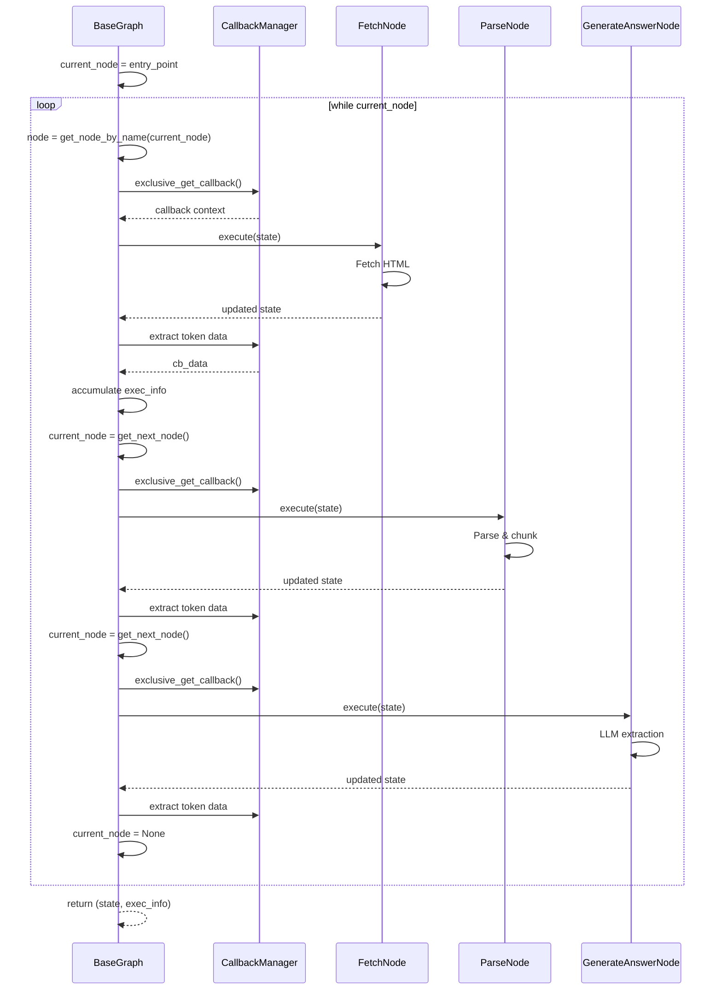
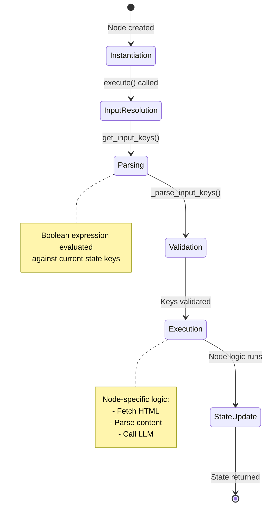
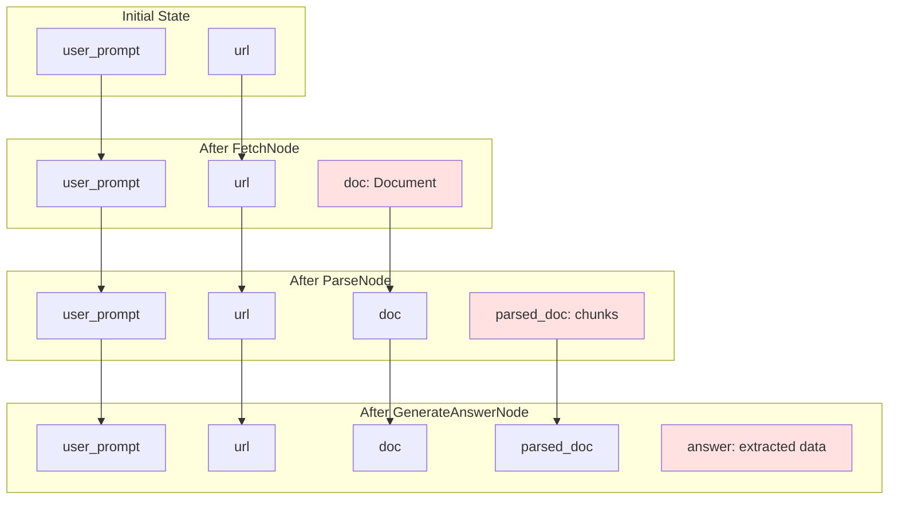
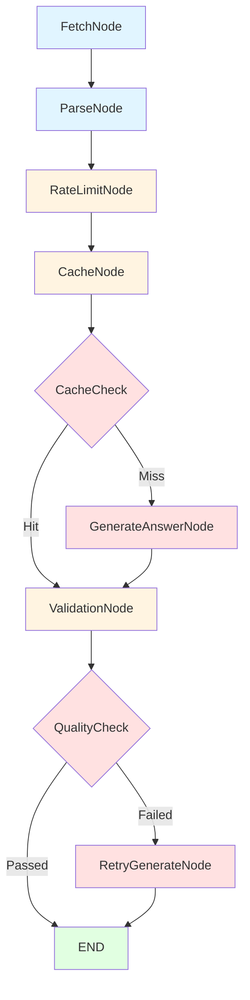

# Deep Dive: The Execution Engine and Node System

**Analysis Based on Commit:** [32d5636ac3465edd0a8af47c6242f16a0beb35f5](https://github.com/ScrapeGraphAI/Scrapegraph-ai/commit/32d5636ac3465edd0a8af47c6242f16a0beb35f5)
**Read Time:** 18 minutes | **Difficulty:** Intermediate-Advanced
**Part 2 of the ScrapeGraphAI Technical Blog Series**

---

## Introduction: From Architecture to Implementation

In [Post 1](./01-architecture-overview.md), we explored ScrapeGraphAI's graph-based architecture from 30,000 feet. We saw how graphs orchestrate nodes, how state flows through the system, and why this architecture makes sense for LLM-based scraping.

But understanding the architecture and understanding the *execution* are different things. When you call `scraper.run()`, what actually happens? How does state transform as it flows through nodes? What mechanisms enable token tracking, error handling, and conditional branching?

In this post, we're diving into the engine room. We'll trace through:

- **The execution loop** - How `BaseGraph._execute_standard()` orchestrates the entire pipeline
- **Node lifecycle** - From instantiation to execution to state updates
- **Core node internals** - The actual implementation of FetchNode, ParseNode, and GenerateAnswerNode
- **State evolution** - Watching data transform step-by-step
- **Token tracking** - How cost management works under the hood
- **Error handling** - Timeout configurations and error propagation
- **Custom nodes** - Building your own processing stages

By the end, you'll understand ScrapeGraphAI well enough to debug issues, extend functionality, and build custom workflows.

Let's start where execution begins: the BaseGraph engine.

---

## The BaseGraph Execution Engine

Every graph execution flows through [`BaseGraph._execute_standard()`](https://github.com/ScrapeGraphAI/Scrapegraph-ai/blob/32d5636ac3465edd0a8af47c6242f16a0beb35f5/scrapegraphai/graphs/base_graph.py#L236). This is the orchestrator—the event loop that drives everything.

### The Core Loop: Sequential Traversal

Here's the essential structure (simplified for clarity):

```python
def _execute_standard(self, initial_state: dict) -> Tuple[dict, list]:
    """
    Executes the graph by traversing nodes starting from the entry point.
    """
    current_node_name = self.entry_point
    state = initial_state

    exec_info = []
    cb_total = {
        "total_tokens": 0,
        "prompt_tokens": 0,
        "completion_tokens": 0,
        "successful_requests": 0,
        "total_cost_USD": 0.0,
    }

    while current_node_name:
        # Get the node to execute
        current_node = self._get_node_by_name(current_node_name)

        # Execute with token tracking
        try:
            result, node_exec_time, cb_data = self._execute_node(
                current_node, state, llm_model, llm_model_name
            )

            # Accumulate execution info
            if cb_data:
                exec_info.append(cb_data)
                for key in cb_total:
                    cb_total[key] += cb_data[key]

            # Determine next node
            current_node_name = self._get_next_node(current_node, result)

        except Exception as e:
            # Log error with telemetry and re-raise
            log_graph_execution(error_node=current_node.node_name, exception=str(e))
            raise e

    return state, exec_info
```

**Key observations:**

1. **It's a while loop**, not recursion. Simple and debuggable.
2. **State is mutated** as it passes through nodes—no copying overhead.
3. **Token tracking happens per-node** via the callback manager.
4. **Next node is determined dynamically** based on current node type.
5. **Errors propagate immediately** with context about which node failed.

### Node Execution with Token Tracking

The `_execute_node()` method is where the magic happens:

```python
def _execute_node(self, current_node, state, llm_model, llm_model_name):
    """Executes a single node and returns execution information."""
    curr_time = time.time()

    # Context manager for exclusive token tracking
    with self.callback_manager.exclusive_get_callback(
        llm_model, llm_model_name
    ) as cb:
        # Execute the node
        result = current_node.execute(state)
        node_exec_time = time.time() - curr_time

        # Extract callback data if available
        cb_data = None
        if cb is not None:
            cb_data = {
                "node_name": current_node.node_name,
                "total_tokens": cb.total_tokens,
                "prompt_tokens": cb.prompt_tokens,
                "completion_tokens": cb.completion_tokens,
                "successful_requests": cb.successful_requests,
                "total_cost_USD": cb.total_cost,
                "exec_time": node_exec_time,
            }

    return result, node_exec_time, cb_data
```

**The context manager pattern is crucial here.** It ensures:

1. Callbacks are **thread-safe** (using a lock)
2. Token counts are **isolated per node** (fresh callback each time)
3. Costs are **accumulated correctly** (callback data returned and summed)

### Determining the Next Node

After a node executes, the graph needs to know where to go next:

```python
def _get_next_node(self, current_node, result):
    """Determines the next node to execute based on current node type and result."""
    if current_node.node_type == "conditional_node":
        # Conditional nodes return the name of the next node
        node_names = {node.node_name for node in self.nodes}
        if result in node_names:
            return result
        elif result is None:
            return None
        raise ValueError(
            f"Conditional Node returned a node name '{result}' that does not exist"
        )

    # Regular nodes follow the edge mapping
    return self.edges.get(current_node.node_name)
```

**Two execution paths:**

1. **Regular nodes**: Follow predefined edges (`self.edges` dictionary)
2. **Conditional nodes**: Return the next node name dynamically (enables branching)

This is how retry logic, content-type branching, and other conditional workflows are implemented.

### Execution Flow Diagram



**Notice:** Each node execution is wrapped in a callback context, ensuring accurate token tracking per stage.

---

## Node Lifecycle: From Creation to Execution

Every node goes through a predictable lifecycle. Understanding this helps you debug issues and build custom nodes.

### 1. Instantiation

Nodes are created during graph construction:

```python
fetch_node = FetchNode(
    input="url | local_dir",      # Input specification
    output=["doc"],                # Output keys
    node_config={                  # Configuration
        "llm_model": llm_model,
        "headless": True,
        "timeout": 30,
    }
)
```

The [`BaseNode.__init__()`](https://github.com/ScrapeGraphAI/Scrapegraph-ai/blob/32d5636ac3465edd0a8af47c6242f16a0beb35f5/scrapegraphai/nodes/base_node.py#L48) sets up:

- **node_name**: Identifier in the graph
- **input**: Boolean expression of required state keys
- **output**: List of keys this node will add to state
- **node_type**: Either "node" or "conditional_node"
- **node_config**: Arbitrary configuration dict

### 2. Input Key Resolution

Before execution, nodes determine what data they need using [`get_input_keys()`](https://github.com/ScrapeGraphAI/Scrapegraph-ai/blob/32d5636ac3465edd0a8af47c6242f16a0beb35f5/scrapegraphai/nodes/base_node.py#L98):

```python
def get_input_keys(self, state: dict) -> List[str]:
    """
    Determines the necessary state keys based on the input specification.
    """
    try:
        input_keys = self._parse_input_keys(state, self.input)
        self._validate_input_keys(input_keys)
        return input_keys
    except ValueError as e:
        raise ValueError(f"Error parsing input keys for {self.node_name}") from e
```

This calls [`_parse_input_keys()`](https://github.com/ScrapeGraphAI/Scrapegraph-ai/blob/32d5636ac3465edd0a8af47c6242f16a0beb35f5/scrapegraphai/nodes/base_node.py#L136), which is a sophisticated expression parser.

### 3. Input Expression Parsing

The input specification is a **boolean expression** that supports:

- **OR (`|`)**: Use any available key (`"url | local_dir"`)
- **AND (`&`)**: Require all keys (`"user_prompt & doc"`)
- **Parentheses**: Group conditions (`"user_prompt & (relevant_chunks | parsed_doc | doc)"`)

Here's how it works:

```python
def _parse_input_keys(self, state: dict, expression: str) -> List[str]:
    """
    Parses the input keys expression to extract relevant keys from state
    based on logical conditions.
    """
    # Remove whitespace
    expression = expression.replace(" ", "")

    # Validate expression structure
    if expression[0] in "&|" or expression[-1] in "&|":
        raise ValueError("Invalid operator usage.")

    # Check balanced parentheses
    if expression.count("(") != expression.count(")"):
        raise ValueError("Missing or unbalanced parentheses in expression.")

    def evaluate_simple_expression(exp: str) -> List[str]:
        """Evaluate an expression without parentheses."""
        # Try each OR segment
        for or_segment in exp.split("|"):
            and_segment = or_segment.split("&")
            # If all AND conditions are met, return those keys
            if all(elem.strip() in state for elem in and_segment):
                return [elem.strip() for elem in and_segment if elem.strip() in state]
        return []

    def evaluate_expression(expression: str) -> List[str]:
        """Evaluate an expression with parentheses."""
        # Process innermost parentheses first
        while "(" in expression:
            start = expression.rfind("(")
            end = expression.find(")", start)
            sub_exp = expression[start + 1 : end]

            sub_result = evaluate_simple_expression(sub_exp)

            # Replace parenthesized expression with result
            expression = (
                expression[:start] + "|".join(sub_result) + expression[end + 1 :]
            )
        return evaluate_simple_expression(expression)

    result = evaluate_expression(expression)

    if not result:
        raise ValueError(
            f"No state keys matched the expression. "
            f"Expression: {expression}. State keys: {', '.join(state.keys())}"
        )

    return result
```

**Example evaluation:**

```python
# State: {"user_prompt": "...", "parsed_doc": [...]}
# Expression: "user_prompt & (relevant_chunks | parsed_doc | doc)"

# Step 1: Evaluate innermost parentheses
#   (relevant_chunks | parsed_doc | doc)
#   → "parsed_doc" (first match in OR)

# Step 2: Evaluate outer AND
#   user_prompt & parsed_doc
#   → ["user_prompt", "parsed_doc"]
```

**Why this matters:** Nodes are self-documenting and flexible. The same node can work with different state configurations.

### 4. Execution

The node's `execute()` method receives the state and returns the updated state:

```python
def execute(self, state: dict) -> dict:
    """
    Execute the node's logic based on the current state.
    """
    # Get required input data
    input_keys = self.get_input_keys(state)
    input_data = [state[key] for key in input_keys]

    # Perform node-specific logic
    result = self._process(input_data)

    # Update state with output
    state.update({self.output[0]: result})

    return state
```

**State mutation is intentional.** Nodes modify the state dict in-place and return it. This avoids copying overhead and makes debugging easier (just print state).

### 5. State Update and Propagation

After execution, the updated state flows to the next node. The execution engine doesn't care about state structure—it just passes the dict along.

**Complete lifecycle diagram:**



---

## Core Nodes Deep Dive

Let's examine the three fundamental nodes that power most scraping workflows.

### 1. FetchNode: Playwright Integration

[`FetchNode`](https://github.com/ScrapeGraphAI/Scrapegraph-ai/blob/32d5636ac3465edd0a8af47c6242f16a0beb35f5/scrapegraphai/nodes/fetch_node.py) is responsible for retrieving content. It handles multiple source types and includes sophisticated timeout management.

**Key features:**

```python
class FetchNode(BaseNode):
    def __init__(self, input: str, output: List[str],
                 node_config: Optional[dict] = None, node_name: str = "Fetch"):
        super().__init__(node_name, "node", input, output, 1, node_config)

        # Configuration
        self.headless = node_config.get("headless", True)
        self.timeout = node_config.get("timeout", 30)  # Configurable timeout
        self.use_soup = node_config.get("use_soup", False)
        self.loader_kwargs = node_config.get("loader_kwargs", {})
```

**Timeout configuration:** The recent [timeout feature](https://github.com/ScrapeGraphAI/Scrapegraph-ai/blob/32d5636ac3465edd0a8af47c6242f16a0beb35f5/scrapegraphai/nodes/fetch_node.py#L74) applies to multiple operations:

```python
def handle_web_source(self, state, source):
    """Handles web source fetching with timeout support."""

    if self.use_soup:
        # HTTP request with timeout
        if self.timeout is None:
            response = requests.get(source)
        else:
            response = requests.get(source, timeout=self.timeout)
    else:
        # ChromiumLoader with timeout
        loader_kwargs = {}
        if "timeout" not in loader_kwargs and self.timeout is not None:
            loader_kwargs["timeout"] = self.timeout

        loader = ChromiumLoader(
            [source],
            headless=self.headless,
            storage_state=self.storage_state,
            **loader_kwargs,
        )
        document = loader.load()
```

**PDF loading with timeout:**

```python
def load_file_content(self, source, input_type):
    """Loads file content with timeout for PDFs."""
    if input_type == "pdf":
        loader = PyPDFLoader(source)

        # PDF parsing can block for large files
        if self.timeout is None:
            return loader.load()
        else:
            with concurrent.futures.ThreadPoolExecutor(max_workers=1) as executor:
                future = executor.submit(loader.load)
                try:
                    return future.result(timeout=self.timeout)
                except concurrent.futures.TimeoutError:
                    raise TimeoutError(
                        f"PDF parsing exceeded timeout of {self.timeout} seconds"
                    )
```

**Design decision:** Timeouts are configurable per-node but default to 30 seconds. This prevents hanging on slow pages while allowing flexibility for known slow sources.

**Example: Custom timeout configuration**

```python
from scrapegraphai.graphs import SmartScraperGraph

config = {
    "llm": {"model": "openai/gpt-4o-mini", "api_key": "..."},
    "loader_kwargs": {
        "timeout": 60  # 60 seconds for slow pages
    }
}

scraper = SmartScraperGraph(
    prompt="Extract article content",
    source="https://very-slow-website.com",
    config=config
)

result = scraper.run()
```

### 2. ParseNode: HTML Cleanup and Chunking

[`ParseNode`](https://github.com/ScrapeGraphAI/Scrapegraph-ai/blob/32d5636ac3465edd0a8af47c6242f16a0beb35f5/scrapegraphai/nodes/parse_node.py) transforms raw HTML into LLM-friendly chunks.

**Execution flow:**

```python
def execute(self, state: dict) -> dict:
    """Parses HTML content and splits it into chunks."""
    input_keys = self.get_input_keys(state)
    input_data = [state[key] for key in input_keys]
    docs_transformed = input_data[0]

    if self.parse_html:
        # Convert HTML to plain text
        docs_transformed = Html2TextTransformer(
            ignore_links=False
        ).transform_documents(input_data[0])
        docs_transformed = docs_transformed[0]

        # Extract URLs if needed
        link_urls, img_urls = self._extract_urls(
            docs_transformed.page_content, source
        )

        # Chunk the text
        chunks = split_text_into_chunks(
            text=docs_transformed.page_content,
            chunk_size=self.chunk_size - 250,  # Buffer for prompt overhead
        )

    state.update({"parsed_doc": chunks})
    return state
```

**Chunking strategy:** The [`split_text_into_chunks()`](https://github.com/ScrapeGraphAI/Scrapegraph-ai/blob/32d5636ac3465edd0a8af47c6242f16a0beb35f5/scrapegraphai/utils/split_text_into_chunks.py) function uses semantic chunking:

```python
def split_text_into_chunks(text: str, chunk_size: int, use_semchunk=True) -> List[str]:
    """
    Splits text into chunks based on token count.
    Uses semchunk for semantic boundary detection.
    """
    if use_semchunk:
        from semchunk import chunk

        def count_tokens(text):
            return num_tokens_calculus(text)

        # Safety margin for chunk size
        chunk_size = min(chunk_size, int(chunk_size * 0.9))

        chunks = chunk(
            text=text,
            chunk_size=chunk_size,
            token_counter=count_tokens,
            memoize=False
        )
        return chunks
```

**Why semantic chunking?** Instead of splitting mid-sentence, `semchunk` tries to split at paragraph or sentence boundaries. This preserves context and improves LLM extraction quality.

**Example: Adjusting chunk size**

```python
config = {
    "llm": {
        "model": "openai/gpt-4o-mini",
        "api_key": "..."
    },
    "chunk_size": 4096  # Smaller chunks for faster processing
}

scraper = SmartScraperGraph(
    prompt="Extract product details",
    source="https://example.com/product",
    config=config
)
```

### 3. GenerateAnswerNode: LLM Integration

[`GenerateAnswerNode`](https://github.com/ScrapeGraphAI/Scrapegraph-ai/blob/32d5636ac3465edd0a8af47c6242f16a0beb35f5/scrapegraphai/nodes/generate_answer_node.py) is where the LLM magic happens.

**Key implementation details:**

```python
def execute(self, state: dict) -> dict:
    """Executes the GenerateAnswerNode."""
    input_keys = self.get_input_keys(state)
    input_data = [state[key] for key in input_keys]
    user_prompt = input_data[0]
    doc = input_data[1]

    # Set up output parser
    if self.node_config.get("schema", None) is not None:
        # Pydantic schema provided
        output_parser = get_pydantic_output_parser(self.node_config["schema"])
        format_instructions = output_parser.get_format_instructions()
    else:
        # Default JSON output
        output_parser = JsonOutputParser()
        format_instructions = (
            "You must respond with a JSON object. "
            "Your response should be formatted as valid JSON..."
        )
```

**Two execution paths:**

**Path 1: Single chunk (no splitting needed)**

```python
if len(doc) == 1:
    prompt = PromptTemplate(
        template=template_no_chunks_prompt,
        input_variables=["content", "question"],
        partial_variables={"format_instructions": format_instructions},
    )
    chain = prompt | self.llm_model
    if output_parser:
        chain = chain | output_parser

    answer = self.invoke_with_timeout(
        chain,
        {"content": doc, "question": user_prompt},
        self.timeout
    )

    state.update({self.output[0]: answer})
    return state
```

**Path 2: Multiple chunks (map-reduce pattern)**

```python
# Process each chunk in parallel
chains_dict = {}
for i, chunk in enumerate(doc):
    prompt = PromptTemplate(
        template=template_chunks_prompt,
        input_variables=["question"],
        partial_variables={
            "content": chunk,
            "chunk_id": i + 1,
            "format_instructions": format_instructions,
        },
    )
    chain_name = f"chunk{i + 1}"
    chains_dict[chain_name] = prompt | self.llm_model
    if output_parser:
        chains_dict[chain_name] = chains_dict[chain_name] | output_parser

# Run all chunks in parallel
async_runner = RunnableParallel(**chains_dict)
batch_results = self.invoke_with_timeout(
    async_runner,
    {"question": user_prompt},
    self.timeout
)

# Merge results
merge_prompt = PromptTemplate(
    template=template_merge_prompt,
    input_variables=["content", "question"],
    partial_variables={"format_instructions": format_instructions},
)
merge_chain = merge_prompt | self.llm_model
if output_parser:
    merge_chain = merge_chain | output_parser

answer = self.invoke_with_timeout(
    merge_chain,
    {"content": batch_results, "question": user_prompt},
    self.timeout
)
```

**LangChain's `RunnableParallel`** enables concurrent LLM calls for different chunks, then merges results. This is **within-node parallelism**—different from graph-level parallelism.

**Timeout handling with retry:**

```python
def invoke_with_timeout(self, chain, inputs, timeout):
    """Helper method to invoke chain with timeout."""
    try:
        start_time = time.time()
        response = chain.invoke(inputs)
        if time.time() - start_time > timeout:
            raise Timeout(f"Response took longer than {timeout} seconds")
        return response
    except Timeout as e:
        self.logger.error(f"Timeout error: {str(e)}")
        raise
    except Exception as e:
        self.logger.error(f"Error during chain execution: {str(e)}")
        raise
```

**Example: Using Pydantic schemas**

```python
from pydantic import BaseModel, Field
from scrapegraphai.graphs import SmartScraperGraph

class Product(BaseModel):
    name: str = Field(description="Product name")
    price: float = Field(description="Price in USD")
    in_stock: bool = Field(description="Availability status")
    features: list[str] = Field(description="Key features")

config = {
    "llm": {"model": "openai/gpt-4o-mini", "api_key": "..."}
}

scraper = SmartScraperGraph(
    prompt="Extract product information",
    source="https://example.com/product",
    config=config,
    schema=Product  # Type-safe output
)

result = scraper.run()  # Returns validated Product instance
print(f"Product: {result.name}, Price: ${result.price}")
```

---

## State Management: Watching Data Flow

State is the lifeblood of the graph. Let's trace how it evolves through a real execution.

### Initial State

```python
initial_state = {
    "user_prompt": "Extract the article title and author",
    "url": "https://example.com/article"
}
```

### After FetchNode

```python
state = {
    "user_prompt": "Extract the article title and author",
    "url": "https://example.com/article",
    "doc": [
        Document(
            page_content="<html><body><h1>Understanding AI</h1>...",
            metadata={"source": "html file"}
        )
    ]
}
```

**Added:** `doc` key with LangChain Document object containing raw HTML.

### After ParseNode

```python
state = {
    "user_prompt": "Extract the article title and author",
    "url": "https://example.com/article",
    "doc": [...],
    "parsed_doc": [
        "Understanding AI\n\nBy Jane Smith\n\nPublished: Jan 15, 2024\n\n...",
        "...continued content from chunk 2...",
        "...continued content from chunk 3..."
    ]
}
```

**Added:** `parsed_doc` key with chunked text (HTML converted to markdown).

### After GenerateAnswerNode

```python
state = {
    "user_prompt": "Extract the article title and author",
    "url": "https://example.com/article",
    "doc": [...],
    "parsed_doc": [...],
    "answer": {
        "title": "Understanding AI",
        "author": "Jane Smith"
    }
}
```

**Added:** `answer` key with extracted structured data.

### State Evolution Diagram



**Notice:** State is **additive**. Previous keys remain available, enabling nodes to access earlier data if needed.

---

## Error Handling and Conditional Branching

Production systems need robust error handling. ScrapeGraphAI provides several mechanisms.

### Conditional Nodes: Branching Logic

[`ConditionalNode`](https://github.com/ScrapeGraphAI/Scrapegraph-ai/blob/32d5636ac3465edd0a8af47c6242f16a0beb35f5/scrapegraphai/nodes/conditional_node.py) enables dynamic routing based on state:

```python
class ConditionalNode(BaseNode):
    def __init__(self, input: str, output: List[str],
                 node_config: Optional[dict] = None, node_name: str = "Cond"):
        super().__init__(node_name, "conditional_node", input, output, 2, node_config)

        self.key_name = self.node_config["key_name"]
        self.condition = self.node_config.get("condition", None)
        self.true_node_name = None   # Set by graph
        self.false_node_name = None  # Set by graph

    def execute(self, state: dict) -> str:
        """Returns the name of the next node to execute."""
        if self.condition:
            # Evaluate complex condition
            condition_result = self._evaluate_condition(state, self.condition)
        else:
            # Simple existence check
            value = state.get(self.key_name)
            condition_result = value is not None and value != ""

        return self.true_node_name if condition_result else self.false_node_name
```

**Condition evaluation uses `simpleeval`** for safe expression parsing:

```python
def _evaluate_condition(self, state: dict, condition: str) -> bool:
    """Evaluates condition expression against state."""
    eval_globals = self.eval_instance.functions.copy()
    eval_globals.update(state)

    try:
        result = simple_eval(
            condition,
            names=eval_globals,
            functions=self.eval_instance.functions,
            operators=self.eval_instance.operators,
        )
        return bool(result)
    except Exception as e:
        raise ValueError(
            f"Error evaluating condition '{condition}' in {self.node_name}: {e}"
        )
```

**Example: Retry logic for empty answers**

```python
from scrapegraphai.graphs import SmartScraperGraph

config = {
    "llm": {"model": "openai/gpt-4o-mini", "api_key": "..."},
    "reattempt": True  # Enable retry on empty answer
}

scraper = SmartScraperGraph(
    prompt="Extract product price",
    source="https://example.com/product",
    config=config
)

# Under the hood, this creates:
# FetchNode → ParseNode → GenerateAnswerNode → ConditionalNode
#                                                     ↓
#                                               RetryGenerateNode
```

The graph configuration creates a conditional node with this logic:

```python
cond_node = ConditionalNode(
    input="answer",
    output=["answer"],
    node_name="ConditionalNode",
    node_config={
        "key_name": "answer",
        "condition": 'not answer or answer=="NA"'  # Retry if empty or "NA"
    },
)
```

### Error Propagation with Context

When a node fails, the error includes execution context:

```python
def _execute_standard(self, initial_state: dict) -> Tuple[dict, list]:
    # ... execution loop ...

    try:
        result, node_exec_time, cb_data = self._execute_node(
            current_node, state, llm_model, llm_model_name
        )
        # ...
    except Exception as e:
        error_node = current_node.node_name
        graph_execution_time = time.time() - start_time

        # Log with telemetry
        log_graph_execution(
            graph_name=self.graph_name,
            source=source,
            prompt=prompt,
            llm_model=llm_model_name,
            execution_time=graph_execution_time,
            error_node=error_node,  # Which node failed
            exception=str(e),        # Error message
        )
        raise e
```

**Debugging benefit:** You immediately know which node failed and can inspect the state at that point.

**Example: Handling errors**

```python
from scrapegraphai.graphs import SmartScraperGraph

scraper = SmartScraperGraph(
    prompt="Extract data",
    source="https://example.com",
    config=config
)

try:
    result = scraper.run()
except Exception as e:
    print(f"Scraping failed: {e}")

    # Check execution info to see how far it got
    exec_info = scraper.get_execution_info()
    for node_info in exec_info:
        print(f"{node_info['node_name']}: {node_info['exec_time']:.2f}s")
```

---

## Token Tracking and Cost Management

Understanding costs is critical for production LLM applications. ScrapeGraphAI tracks this automatically.

### CustomLLMCallbackManager Implementation

The [`CustomLLMCallbackManager`](https://github.com/ScrapeGraphAI/Scrapegraph-ai/blob/32d5636ac3465edd0a8af47c6242f16a0beb35f5/scrapegraphai/utils/llm_callback_manager.py) wraps each node execution:

```python
class CustomLLMCallbackManager:
    """Thread-safe callback manager for LLM token tracking."""

    _lock = threading.Lock()

    @contextmanager
    def exclusive_get_callback(self, llm_model, llm_model_name):
        """Provides exclusive callback for the LLM model."""
        if CustomLLMCallbackManager._lock.acquire(blocking=False):
            try:
                if isinstance(llm_model, ChatOpenAI) or isinstance(llm_model, AzureChatOpenAI):
                    with get_openai_callback() as cb:
                        yield cb
                elif isinstance(llm_model, ChatBedrock) and "claude" in llm_model_name:
                    with get_bedrock_anthropic_callback() as cb:
                        yield cb
                else:
                    with get_custom_callback(llm_model_name) as cb:
                        yield cb
            finally:
                CustomLLMCallbackManager._lock.release()
        else:
            yield None
```

**Design decision: Thread lock ensures exclusive access.** Only one node can track tokens at a time, preventing concurrent updates to callback state.

### Custom Callback Handler

For models without native LangChain callbacks, [`CustomCallbackHandler`](https://github.com/ScrapeGraphAI/Scrapegraph-ai/blob/32d5636ac3465edd0a8af47c6242f16a0beb35f5/scrapegraphai/utils/custom_callback.py) provides tracking:

```python
class CustomCallbackHandler(BaseCallbackHandler):
    """Callback Handler that tracks LLM info."""

    total_tokens: int = 0
    prompt_tokens: int = 0
    completion_tokens: int = 0
    successful_requests: int = 0
    total_cost: float = 0.0

    def __init__(self, llm_model_name: str) -> None:
        super().__init__()
        self._lock = threading.Lock()
        self.model_name = llm_model_name if llm_model_name else "unknown"

    def on_llm_end(self, response: LLMResult, **kwargs: Any) -> None:
        """Collect token usage."""
        # Extract token usage from response
        generation = response.generations[0][0]
        if isinstance(generation, ChatGeneration):
            message = generation.message
            if isinstance(message, AIMessage):
                usage_metadata = message.usage_metadata
                completion_tokens = usage_metadata["output_tokens"]
                prompt_tokens = usage_metadata["input_tokens"]

        # Calculate costs
        if self.model_name in MODEL_COST_PER_1K_TOKENS_INPUT:
            completion_cost = get_token_cost_for_model(
                self.model_name, completion_tokens, is_completion=True
            )
            prompt_cost = get_token_cost_for_model(
                self.model_name, prompt_tokens
            )

        # Update shared state with lock
        with self._lock:
            self.total_cost += prompt_cost + completion_cost
            self.total_tokens += usage_metadata["total_tokens"]
            self.prompt_tokens += prompt_tokens
            self.completion_tokens += completion_tokens
            self.successful_requests += 1
```

**Cost calculation** uses a [comprehensive model pricing table](https://github.com/ScrapeGraphAI/Scrapegraph-ai/blob/32d5636ac3465edd0a8af47c6242f16a0beb35f5/scrapegraphai/utils/model_costs.py):

```python
MODEL_COST_PER_1K_TOKENS_INPUT = {
    "gpt-4o": 0.005,
    "gpt-4o-mini": 0.00015,
    "gpt-4-turbo": 0.01,
    "claude-3-5-sonnet-20241022": 0.003,
    "claude-3-opus-20240229": 0.015,
    # ... 50+ models
}
```

### Execution Info Structure

After execution, you get detailed cost breakdown:

```python
exec_info = [
    {
        "node_name": "Fetch",
        "total_tokens": 0,
        "prompt_tokens": 0,
        "completion_tokens": 0,
        "successful_requests": 0,
        "total_cost_USD": 0.0,
        "exec_time": 1.23
    },
    {
        "node_name": "GenerateAnswer",
        "total_tokens": 1547,
        "prompt_tokens": 1203,
        "completion_tokens": 344,
        "successful_requests": 1,
        "total_cost_USD": 0.00023,
        "exec_time": 2.45
    },
    {
        "node_name": "TOTAL RESULT",
        "total_tokens": 1547,
        "prompt_tokens": 1203,
        "completion_tokens": 344,
        "successful_requests": 1,
        "total_cost_USD": 0.00023,
        "exec_time": 3.68
    }
]
```

**Example: Budget monitoring**

```python
from scrapegraphai.graphs import SmartScraperGraph

config = {
    "llm": {"model": "openai/gpt-4o", "api_key": "..."}
}

scraper = SmartScraperGraph(
    prompt="Extract detailed product information",
    source="https://example.com/product",
    config=config
)

result = scraper.run()

# Check if costs exceeded budget
exec_info = scraper.get_execution_info()
total_info = exec_info[-1]
total_cost = total_info["total_cost_USD"]

if total_cost > 0.01:  # $0.01 budget
    print(f"Warning: Cost ${total_cost:.4f} exceeded budget!")
    print(f"Tokens used: {total_info['total_tokens']}")

    # Consider switching to cheaper model
    config["llm"]["model"] = "openai/gpt-4o-mini"
```

---

## Creating Custom Nodes

The node abstraction makes extending ScrapeGraphAI straightforward. Here are real examples.

### Example 1: Image OCR Node

```python
from typing import List, Optional
from scrapegraphai.nodes import BaseNode
from langchain_core.documents import Document

class ImageOCRNode(BaseNode):
    """
    Extracts text from images using OCR.
    """

    def __init__(
        self,
        input: str,
        output: List[str],
        node_config: Optional[dict] = None,
        node_name: str = "ImageOCR",
    ):
        super().__init__(node_name, "node", input, output, 1, node_config)

        # Initialize OCR engine
        try:
            import pytesseract
            self.ocr = pytesseract
        except ImportError:
            raise ImportError(
                "pytesseract not installed. Run: pip install pytesseract"
            )

    def execute(self, state: dict) -> dict:
        """Extract text from images."""
        self.logger.info(f"--- Executing {self.node_name} Node ---")

        # Get input
        input_keys = self.get_input_keys(state)
        images = state[input_keys[0]]  # List of image paths or URLs

        # Process each image
        extracted_texts = []
        for img_path in images:
            text = self.ocr.image_to_string(img_path)
            extracted_texts.append(text)

        # Create document
        combined_text = "\n\n".join(extracted_texts)
        document = Document(
            page_content=combined_text,
            metadata={"source": "ocr", "image_count": len(images)}
        )

        # Update state
        state.update({self.output[0]: [document]})
        return state
```

**Usage:**

```python
from scrapegraphai.graphs import BaseGraph
from scrapegraphai.nodes import ParseNode, GenerateAnswerNode

# Build custom graph
ocr_node = ImageOCRNode(
    input="images",
    output=["doc"]
)

parse_node = ParseNode(
    input="doc",
    output=["parsed_doc"],
    node_config={"chunk_size": 4096}
)

generate_node = GenerateAnswerNode(
    input="user_prompt & parsed_doc",
    output=["answer"],
    node_config={"llm_model": llm_model}
)

graph = BaseGraph(
    nodes=[ocr_node, parse_node, generate_node],
    edges=[
        (ocr_node, parse_node),
        (parse_node, generate_node)
    ],
    entry_point=ocr_node
)

# Run
state, exec_info = graph.execute({
    "user_prompt": "Summarize the document",
    "images": ["page1.png", "page2.png", "page3.png"]
})
```

### Example 2: Cache Node

```python
import hashlib
import json
from typing import List, Optional
from scrapegraphai.nodes import BaseNode

class CacheNode(BaseNode):
    """
    Caches LLM responses to avoid redundant API calls.
    """

    def __init__(
        self,
        input: str,
        output: List[str],
        node_config: Optional[dict] = None,
        node_name: str = "Cache",
    ):
        super().__init__(node_name, "node", input, output, 1, node_config)
        self.cache = {}  # In-memory cache (use Redis for production)
        self.ttl = node_config.get("ttl", 3600)  # Cache TTL in seconds

    def _get_cache_key(self, prompt: str, content: str) -> str:
        """Generate cache key from prompt and content."""
        combined = f"{prompt}:{content}"
        return hashlib.md5(combined.encode()).hexdigest()

    def execute(self, state: dict) -> dict:
        """Check cache before proceeding."""
        self.logger.info(f"--- Executing {self.node_name} Node ---")

        input_keys = self.get_input_keys(state)
        prompt = state.get("user_prompt", "")
        content = str(state.get(input_keys[0], ""))

        # Generate cache key
        cache_key = self._get_cache_key(prompt, content)

        # Check cache
        if cache_key in self.cache:
            self.logger.info("Cache hit!")
            cached_result = self.cache[cache_key]
            state.update({self.output[0]: cached_result})
            state["cache_hit"] = True
        else:
            self.logger.info("Cache miss - will proceed to LLM")
            state["cache_hit"] = False
            state["cache_key"] = cache_key

        return state
```

**Usage with conditional branching:**

```python
from scrapegraphai.nodes import ConditionalNode

# Create nodes
cache_node = CacheNode(
    input="parsed_doc",
    output=["answer"]
)

conditional_node = ConditionalNode(
    input="cache_hit",
    output=["answer"],
    node_config={"key_name": "cache_hit"}
)

generate_node = GenerateAnswerNode(
    input="user_prompt & parsed_doc",
    output=["answer"],
    node_config={"llm_model": llm_model}
)

# Build graph with branching
graph = BaseGraph(
    nodes=[fetch_node, parse_node, cache_node, conditional_node, generate_node],
    edges=[
        (fetch_node, parse_node),
        (parse_node, cache_node),
        (cache_node, conditional_node),
        (conditional_node, generate_node),  # Cache miss
        (conditional_node, None)             # Cache hit - skip to end
    ],
    entry_point=fetch_node
)
```

### Example 3: Rate Limiting Node

```python
import time
from typing import List, Optional
from scrapegraphai.nodes import BaseNode

class RateLimitNode(BaseNode):
    """
    Enforces rate limiting between requests.
    """

    def __init__(
        self,
        input: str,
        output: List[str],
        node_config: Optional[dict] = None,
        node_name: str = "RateLimit",
    ):
        super().__init__(node_name, "node", input, output, 0, node_config)

        self.requests_per_minute = node_config.get("requests_per_minute", 10)
        self.last_request_time = 0
        self.min_interval = 60.0 / self.requests_per_minute

    def execute(self, state: dict) -> dict:
        """Enforce rate limiting."""
        self.logger.info(f"--- Executing {self.node_name} Node ---")

        # Calculate time since last request
        current_time = time.time()
        time_since_last = current_time - self.last_request_time

        # Sleep if needed
        if time_since_last < self.min_interval:
            sleep_time = self.min_interval - time_since_last
            self.logger.info(f"Rate limiting: sleeping {sleep_time:.2f}s")
            time.sleep(sleep_time)

        # Update last request time
        self.last_request_time = time.time()

        return state
```

**Usage:**

```python
# Add rate limiting before fetch
rate_limit_node = RateLimitNode(
    input="url",
    output=[],
    node_config={"requests_per_minute": 20}
)

graph = BaseGraph(
    nodes=[rate_limit_node, fetch_node, parse_node, generate_node],
    edges=[
        (rate_limit_node, fetch_node),
        (fetch_node, parse_node),
        (parse_node, generate_node)
    ],
    entry_point=rate_limit_node
)
```

### Example 4: Validation Node

```python
from typing import List, Optional
from pydantic import ValidationError
from scrapegraphai.nodes import BaseNode

class ValidationNode(BaseNode):
    """
    Validates extracted data against a schema.
    """

    def __init__(
        self,
        input: str,
        output: List[str],
        node_config: Optional[dict] = None,
        node_name: str = "Validation",
    ):
        super().__init__(node_name, "node", input, output, 1, node_config)
        self.schema = node_config.get("schema")
        self.strict = node_config.get("strict", True)

    def execute(self, state: dict) -> dict:
        """Validate extracted data."""
        self.logger.info(f"--- Executing {self.node_name} Node ---")

        input_keys = self.get_input_keys(state)
        data = state[input_keys[0]]

        try:
            # Validate against Pydantic schema
            validated_data = self.schema(**data)
            state.update({self.output[0]: validated_data.dict()})
            state["validation_passed"] = True
        except ValidationError as e:
            self.logger.error(f"Validation failed: {e}")
            if self.strict:
                raise
            else:
                # Non-strict mode: log error but continue
                state["validation_passed"] = False
                state["validation_errors"] = str(e)

        return state
```

---

## Complete Example: Custom Graph with All Concepts

Here's a full example that demonstrates everything we've covered:

```python
"""
Complete custom graph demonstrating:
- Custom nodes
- Conditional branching
- Error handling
- Token tracking
- Timeout configuration
"""

from pydantic import BaseModel, Field
from scrapegraphai.graphs import BaseGraph
from scrapegraphai.nodes import (
    FetchNode, ParseNode, GenerateAnswerNode, ConditionalNode
)
from langchain_openai import ChatOpenAI

# Define output schema
class Article(BaseModel):
    title: str = Field(description="Article title")
    author: str = Field(description="Author name")
    summary: str = Field(description="Brief summary")
    key_points: list[str] = Field(description="Main points")

# Initialize LLM
llm_model = ChatOpenAI(
    model="gpt-4o-mini",
    api_key="your-api-key"
)

# Create nodes
fetch_node = FetchNode(
    input="url | local_dir",
    output=["doc"],
    node_config={
        "llm_model": llm_model,
        "headless": True,
        "timeout": 45  # Custom timeout
    }
)

parse_node = ParseNode(
    input="doc",
    output=["parsed_doc"],
    node_config={
        "llm_model": llm_model,
        "chunk_size": 4096
    }
)

# Rate limiting
rate_limit_node = RateLimitNode(
    input="parsed_doc",
    output=[],
    node_config={"requests_per_minute": 30}
)

# Cache check
cache_node = CacheNode(
    input="parsed_doc",
    output=["answer"]
)

# Conditional: use cache or call LLM?
cache_check = ConditionalNode(
    input="cache_hit",
    output=["answer"],
    node_name="CacheCheck",
    node_config={"key_name": "cache_hit"}
)

# LLM extraction
generate_node = GenerateAnswerNode(
    input="user_prompt & parsed_doc",
    output=["answer"],
    node_config={
        "llm_model": llm_model,
        "schema": Article,
        "timeout": 120
    }
)

# Validation
validation_node = ValidationNode(
    input="answer",
    output=["validated_answer"],
    node_config={
        "schema": Article,
        "strict": False  # Don't fail on validation errors
    }
)

# Quality check conditional
quality_check = ConditionalNode(
    input="validation_passed",
    output=["validated_answer"],
    node_name="QualityCheck",
    node_config={"key_name": "validation_passed"}
)

# Retry with different prompt
retry_node = GenerateAnswerNode(
    input="user_prompt & parsed_doc",
    output=["answer"],
    node_name="RetryGenerate",
    node_config={
        "llm_model": llm_model,
        "schema": Article,
        "additional_info": "Previous attempt failed validation. Be more careful with formatting."
    }
)

# Build graph
graph = BaseGraph(
    nodes=[
        fetch_node,
        parse_node,
        rate_limit_node,
        cache_node,
        cache_check,
        generate_node,
        validation_node,
        quality_check,
        retry_node
    ],
    edges=[
        (fetch_node, parse_node),
        (parse_node, rate_limit_node),
        (rate_limit_node, cache_node),
        (cache_node, cache_check),
        (cache_check, generate_node),    # Cache miss
        (cache_check, validation_node),  # Cache hit - validate cached result
        (generate_node, validation_node),
        (validation_node, quality_check),
        (quality_check, retry_node),     # Validation failed
        (quality_check, None),           # Validation passed - done
        (retry_node, None)
    ],
    entry_point=fetch_node,
    graph_name="CustomArticleExtractor"
)

# Execute
state, exec_info = graph.execute({
    "user_prompt": "Extract article metadata",
    "url": "https://example.com/article"
})

# Analyze results
print("\n=== Execution Results ===")
print(f"Final answer: {state.get('validated_answer')}")
print(f"Cache hit: {state.get('cache_hit', False)}")
print(f"Validation passed: {state.get('validation_passed', False)}")

print("\n=== Cost Breakdown ===")
for info in exec_info:
    print(f"{info['node_name']:20s} | "
          f"Tokens: {info['total_tokens']:5d} | "
          f"Cost: ${info['total_cost_USD']:.4f} | "
          f"Time: {info['exec_time']:.2f}s")

total = exec_info[-1]
print(f"\nTotal cost: ${total['total_cost_USD']:.4f}")
print(f"Total time: {total['exec_time']:.2f}s")
```

**Graph visualization:**



---

## Key Takeaways

After diving deep into the execution engine, here are the critical insights:

### 1. Sequential Execution Simplifies Reasoning

The while-loop execution model is simple but effective:
- Easy to step through with a debugger
- Predictable performance characteristics
- Token usage is deterministic
- No concurrency complexity

**Lesson:** Don't add complexity you don't need. Sequential execution works great for most scraping workflows.

### 2. State as a Dictionary Works Beautifully

Mutable state passed by reference:
- Zero serialization overhead
- Simple to debug (just print it)
- Natural accumulation pattern
- Nodes can access all previous data

**Lesson:** Functional purity is great for some domains, but pragmatic mutability works better for data pipelines.

### 3. Input Expression Parsing Enables Flexibility

Boolean expressions like `"user_prompt & (relevant_chunks | parsed_doc | doc)"`:
- Self-documenting node requirements
- Flexible fallback logic
- Works with varying state shapes
- Enables node reuse across graphs

**Lesson:** Declarative specifications are worth the implementation complexity.

### 4. Token Tracking Should Be Built-In

The callback manager approach:
- Automatic per-node tracking
- Thread-safe aggregation
- Cost calculation included
- No manual instrumentation needed

**Lesson:** Observability should be a first-class feature, not an afterthought.

### 5. Conditional Nodes Enable Sophisticated Workflows

Dynamic routing based on state:
- Retry logic when LLM returns empty
- Different paths for different content types
- Quality checks with fallbacks
- A/B testing different approaches

**Lesson:** Conditional branching unlocks advanced patterns without complicating the core execution model.

### 6. Timeout Configuration Prevents Hanging

Timeouts at multiple levels:
- HTTP requests
- PDF parsing
- LLM calls
- Playwright page loads

**Lesson:** Production systems need timeout protection at every I/O boundary.

### 7. Custom Nodes Are Straightforward

The node abstraction is clean:
- Inherit from BaseNode
- Implement execute(state) -> state
- Declare input/output specifications
- Add to graph like built-in nodes

**Lesson:** Good abstractions make extension natural.

---

## What's Next

In **Post 3**, we'll explore the design patterns that make this architecture extensible:

- **Template Method Pattern** - How AbstractGraph structures LLM initialization
- **Factory Pattern** - Multi-provider LLM instantiation
- **Observer Pattern** - Callback system for monitoring
- **Strategy Pattern** - Graph variations based on config
- **Dependency Injection** - Node configuration and customization

We'll see how these patterns work together to create a flexible, maintainable codebase.

---

## Further Reading

**Source Code (commit 32d5636):**
- [BaseGraph._execute_standard()](https://github.com/ScrapeGraphAI/Scrapegraph-ai/blob/32d5636ac3465edd0a8af47c6242f16a0beb35f5/scrapegraphai/graphs/base_graph.py#L236) - The execution engine
- [BaseNode](https://github.com/ScrapeGraphAI/Scrapegraph-ai/blob/32d5636ac3465edd0a8af47c6242f16a0beb35f5/scrapegraphai/nodes/base_node.py) - Node abstraction
- [FetchNode](https://github.com/ScrapeGraphAI/Scrapegraph-ai/blob/32d5636ac3465edd0a8af47c6242f16a0beb35f5/scrapegraphai/nodes/fetch_node.py) - Playwright integration
- [ParseNode](https://github.com/ScrapeGraphAI/Scrapegraph-ai/blob/32d5636ac3465edd0a8af47c6242f16a0beb35f5/scrapegraphai/nodes/parse_node.py) - HTML cleanup and chunking
- [GenerateAnswerNode](https://github.com/ScrapeGraphAI/Scrapegraph-ai/blob/32d5636ac3465edd0a8af47c6242f16a0beb35f5/scrapegraphai/nodes/generate_answer_node.py) - LLM extraction
- [ConditionalNode](https://github.com/ScrapeGraphAI/Scrapegraph-ai/blob/32d5636ac3465edd0a8af47c6242f16a0beb35f5/scrapegraphai/nodes/conditional_node.py) - Branching logic
- [CustomLLMCallbackManager](https://github.com/ScrapeGraphAI/Scrapegraph-ai/blob/32d5636ac3465edd0a8af47c6242f16a0beb35f5/scrapegraphai/utils/llm_callback_manager.py) - Token tracking
- [CustomCallbackHandler](https://github.com/ScrapeGraphAI/Scrapegraph-ai/blob/32d5636ac3465edd0a8af47c6242f16a0beb35f5/scrapegraphai/utils/custom_callback.py) - Cost calculation

**Previous Posts:**
- [Post 1 - Architecture Overview](./01-architecture-overview.md)

**Series Overview:**
- [Blog Series Outline](./00-series-outline.md)

---

← [Post 1 - Architecture Overview](./01-architecture-overview.md) | **Post 3 - Design Patterns and Engineering Practices** (coming soon) →

---

*This post is part of a [technical blog series](./00-series-outline.md) analyzing the ScrapeGraphAI codebase. All examples are based on commit [32d5636](https://github.com/ScrapeGraphAI/Scrapegraph-ai/commit/32d5636ac3465edd0a8af47c6242f16a0beb35f5).*
