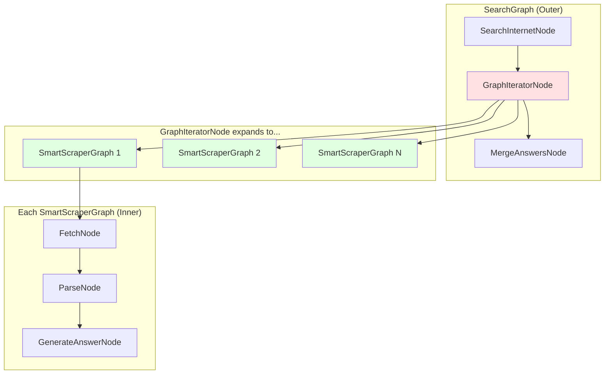
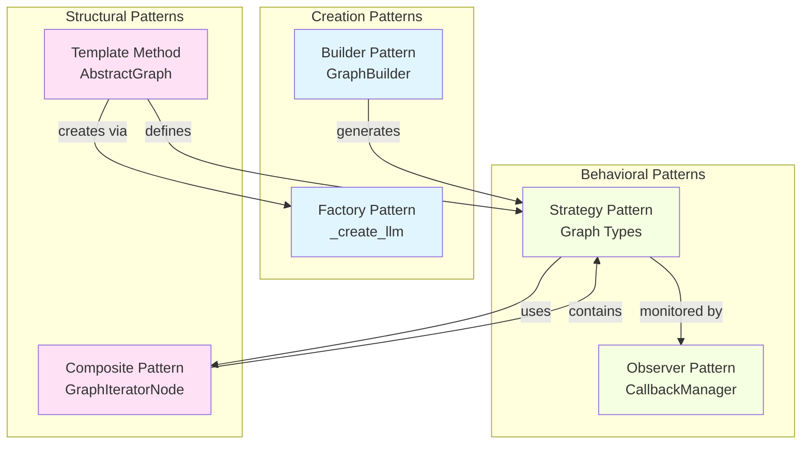
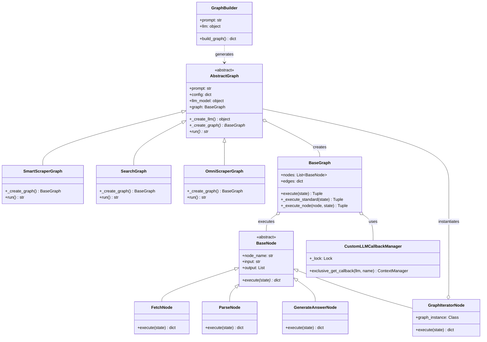

# Design Patterns and Engineering Practices in ScrapeGraphAI

**Analysis Based on Commit:** [32d5636ac3465edd0a8af47c6242f16a0beb35f5](https://github.com/ScrapeGraphAI/Scrapegraph-ai/commit/32d5636ac3465edd0a8af47c6242f16a0beb35f5)
**Read Time:** 15 minutes | **Difficulty:** Intermediate
**Part 3 of the ScrapeGraphAI Technical Blog Series**

---

## Introduction: Why Patterns Matter in LLM Applications

Building LLM applications is deceptively hard. The "hello world" demo takes 10 minutes—you send a prompt to an API and get back text. Easy, right? But production LLM applications face unique challenges:

- **Provider flexibility:** You need to swap between OpenAI, Anthropic, Gemini, local models, and proprietary APIs without rewriting code
- **Behavioral variants:** The same scraping logic might need HTML parsing, RAG retrieval, conditional retry, or reasoning chains depending on context
- **Extensibility:** Users want to add custom nodes, build new graph types, and compose workflows in ways you didn't anticipate
- **Observability:** Token tracking, cost monitoring, and execution telemetry aren't optional—they're essential
- **Composition:** Complex workflows emerge from combining simpler operations

Here's the problem: if you architect this naively, you end up with a tangled mess of if-statements, tight coupling, and a system that's impossible to extend.

ScrapeGraphAI avoids this through disciplined use of **design patterns**. Not the academic kind that exist in textbooks—the pragmatic kind that solve real problems. In this post, we'll dissect the key patterns that make ScrapeGraphAI extensible, maintainable, and production-ready.

We'll cover:
- **Template Method** for defining customizable workflows
- **Factory Pattern** for multi-provider LLM support
- **Strategy Pattern** for different scraping behaviors
- **Observer Pattern** for token/cost monitoring
- **Builder Pattern** for natural language graph construction
- **Composite Pattern** for graphs within graphs

By the end, you'll understand not just *what* patterns are used, but *why* they were chosen and *when* to apply them in your own LLM applications.

---

## Template Method Pattern: The AbstractGraph Backbone

### The Problem

You have 27 different graph types (`SmartScraperGraph`, `SearchGraph`, `OmniScraperGraph`, etc.). Each one needs to:
1. Initialize common state (LLM model, config, schema)
2. Create a **different** graph structure
3. Execute the graph in a **standard** way

If every graph implements this from scratch, you get massive code duplication and inconsistent behavior.

### The Solution: Template Method

The Template Method pattern defines the skeleton of an algorithm in a base class, letting subclasses override specific steps without changing the overall structure.

Here's how [`AbstractGraph`](https://github.com/ScrapeGraphAI/Scrapegraph-ai/blob/32d5636ac3465edd0a8af47c6242f16a0beb35f5/scrapegraphai/graphs/abstract_graph.py) uses it:

```python
class AbstractGraph(ABC):
    """
    Template for all graph types. Handles:
    - Common initialization
    - LLM creation
    - Graph execution

    Subclasses MUST implement _create_graph() to define structure.
    """

    def __init__(self, prompt: str, config: dict,
                 source: Optional[str] = None,
                 schema: Optional[Type[BaseModel]] = None):
        # Step 1: Common initialization
        self.prompt = prompt
        self.source = source
        self.config = config
        self.schema = schema

        # Step 2: Factory method for LLM (more on this later)
        self.llm_model = self._create_llm(config["llm"])

        # Step 3: Call abstract method - subclasses define graph structure
        self.graph = self._create_graph()

        # Step 4: Set common parameters across all nodes
        common_params = {
            "headless": self.config.get("headless", True),
            "verbose": self.config.get("verbose", False),
            "llm_model": self.llm_model,
            "timeout": self.config.get("timeout", 480),
        }
        self.set_common_params(common_params, overwrite=True)

    @abstractmethod
    def _create_graph(self) -> BaseGraph:
        """Subclasses MUST implement this to define graph structure."""
        pass

    def run(self) -> str:
        """Template method - same for all graphs."""
        inputs = {"user_prompt": self.prompt, self.input_key: self.source}
        self.final_state, self.execution_info = self.graph.execute(inputs)
        return self.final_state.get("answer", "No answer found.")
```

Now look at how [`SmartScraperGraph`](https://github.com/ScrapeGraphAI/Scrapegraph-ai/blob/32d5636ac3465edd0a8af47c6242f16a0beb35f5/scrapegraphai/graphs/smart_scraper_graph.py) uses this:

```python
class SmartScraperGraph(AbstractGraph):
    """Concrete graph that ONLY defines structure, not execution."""

    def _create_graph(self) -> BaseGraph:
        """This is the ONLY method we need to implement."""
        fetch_node = FetchNode(
            input="url | local_dir",
            output=["doc"]
        )
        parse_node = ParseNode(
            input="doc",
            output=["parsed_doc"]
        )
        generate_answer_node = GenerateAnswerNode(
            input="user_prompt & (parsed_doc | doc)",
            output=["answer"]
        )

        return BaseGraph(
            nodes=[fetch_node, parse_node, generate_answer_node],
            edges=[
                (fetch_node, parse_node),
                (parse_node, generate_answer_node)
            ],
            entry_point=fetch_node
        )
```

### Why This Works

**Separation of concerns:**
- `AbstractGraph` handles initialization, LLM creation, parameter propagation, and execution
- Subclasses focus **only** on defining graph structure

**Consistency:**
- All graphs execute the same way (via `BaseGraph.execute()`)
- All graphs handle config, schema, and state identically
- Debugging tools work across all graph types

**Extensibility:**
- Want a new graph type? Implement one method: `_create_graph()`
- No need to understand execution logic, state management, or telemetry

**Trade-offs:**
- **Pro:** Massive reduction in boilerplate (27 graph types, ~50 lines each vs ~500 lines each)
- **Pro:** Guaranteed consistent behavior across all graphs
- **Con:** Harder to customize execution if you need graph-specific behavior
- **Con:** The "magic" of abstract methods can confuse newcomers

### When to Use Template Method

Use this pattern when:
- You have multiple variants that share the same **algorithm structure** but differ in **specific steps**
- You want to enforce consistency while allowing customization
- The invariant parts are complex (initialization, cleanup, error handling)

Don't use it when:
- Variants are too different to share a common structure
- You need complete control over execution flow in subclasses

---

## Factory Pattern: Multi-Provider LLM Support

### The Problem

ScrapeGraphAI supports 18+ LLM providers:
- OpenAI, Anthropic, Google (Gemini & Vertex), Groq, Mistral
- Bedrock, Azure OpenAI, Fireworks, Together AI
- Local models via Ollama, HuggingFace
- Custom providers (OneAPI, DeepSeek, Ernie, XAI, CLoD)

Each provider has different:
- Initialization parameters
- Authentication methods
- API clients
- Token limits

If you sprinkle `if provider == "openai": ...` throughout the codebase, you get unmaintainable spaghetti.

### The Solution: Factory Method

The Factory Pattern encapsulates object creation logic, letting you create instances without specifying their exact classes.

Here's the [`_create_llm()` factory method](https://github.com/ScrapeGraphAI/Scrapegraph-ai/blob/32d5636ac3465edd0a8af47c6242f16a0beb35f5/scrapegraphai/graphs/abstract_graph.py#L117) from `AbstractGraph`:

```python
def _create_llm(self, llm_config: dict) -> object:
    """
    Factory method: Create appropriate LLM instance based on config.

    Input: {"model": "gpt-4", "api_key": "...", "temperature": 0.7}
    Output: ChatOpenAI instance (or Anthropic, Gemini, etc.)
    """

    llm_defaults = {"streaming": False}
    llm_params = {**llm_defaults, **llm_config}

    # Handle rate limiting configuration
    rate_limit_params = llm_params.pop("rate_limit", {})
    if rate_limit_params:
        requests_per_second = rate_limit_params.get("requests_per_second")
        if requests_per_second:
            llm_params["rate_limiter"] = InMemoryRateLimiter(
                requests_per_second=requests_per_second
            )

    # Early return: Pre-instantiated model
    if "model_instance" in llm_params:
        self.model_token = llm_params["model_tokens"]
        return llm_params["model_instance"]

    # Provider inference: Support "provider/model" format
    if "/" in llm_params["model"]:
        split_model_provider = llm_params["model"].split("/", 1)
        llm_params["model_provider"] = split_model_provider[0]
        llm_params["model"] = split_model_provider[1]
    else:
        # Infer provider from model name via lookup table
        possible_providers = [
            provider for provider, models_d in models_tokens.items()
            if llm_params["model"] in models_d
        ]
        if len(possible_providers) <= 0:
            raise ValueError(f"Model {llm_params['model']} not supported")
        llm_params["model_provider"] = possible_providers[0]

    # Set token limits from lookup table
    if llm_params.get("model_tokens", None) is None:
        try:
            self.model_token = models_tokens[
                llm_params["model_provider"]
            ][llm_params["model"]]
        except KeyError:
            print("Max tokens not found, using default: 8192")
            self.model_token = 8192

    # Provider-specific instantiation
    known_providers = {
        "openai", "azure_openai", "google_genai", "google_vertexai",
        "ollama", "nvidia", "groq", "anthropic", "bedrock",
        "mistralai", "hugging_face", "fireworks", "togetherai",
        "oneapi", "deepseek", "ernie", "clod", "xai"
    }

    if llm_params["model_provider"] not in known_providers:
        raise ValueError(f"Provider {llm_params['model_provider']} not supported")

    # Standard providers use LangChain's init_chat_model
    if llm_params["model_provider"] not in {
        "oneapi", "nvidia", "ernie", "deepseek", "togetherai", "clod", "xai"
    }:
        return init_chat_model(**llm_params)

    # Custom providers have special handling
    model_provider = llm_params.pop("model_provider")

    if model_provider == "clod":
        return CLoD(**llm_params)
    elif model_provider == "deepseek":
        return DeepSeek(**llm_params)
    elif model_provider == "ernie":
        from langchain_community.chat_models import ErnieBotChat
        return ErnieBotChat(**llm_params)
    elif model_provider == "oneapi":
        return OneApi(**llm_params)
    elif model_provider == "xai":
        return XAI(**llm_params)
    elif model_provider == "togetherai":
        from langchain_together import ChatTogether
        return ChatTogether(**llm_params)
    elif model_provider == "nvidia":
        from langchain_nvidia_ai_endpoints import ChatNVIDIA
        return ChatNVIDIA(**llm_params)
```

### Why This Works

**Centralized creation logic:**
- All LLM instantiation goes through one method
- Provider-specific quirks are isolated here
- Easy to add new providers (just extend the factory)

**Flexible configuration:**
```python
# Simple: Just specify model name
config = {"llm": {"model": "gpt-4"}}

# Provider inference: Auto-detect from format
config = {"llm": {"model": "openai/gpt-4"}}

# Full control: Specify everything
config = {
    "llm": {
        "model_provider": "anthropic",
        "model": "claude-3-sonnet",
        "temperature": 0.7,
        "rate_limit": {"requests_per_second": 10}
    }
}

# Pre-instantiated: Bring your own model
my_llm = ChatOpenAI(model="gpt-4", temperature=0.5)
config = {"llm": {"model_instance": my_llm, "model_tokens": 8192}}
```

**Type abstraction:**
- The rest of the codebase doesn't care about provider details
- Nodes work with any LLM that implements the LangChain chat interface
- Testing is easy—mock the factory method

**Trade-offs:**
- **Pro:** Adding a new provider is a localized change
- **Pro:** Config validation happens in one place
- **Pro:** Rate limiting and token tracking work uniformly
- **Con:** The factory method gets long (but it's better than scattering this logic)
- **Con:** Provider-specific features require abstraction layers

### When to Use Factory Pattern

Use this pattern when:
- You have multiple implementations of a common interface
- Creation logic is complex (config parsing, authentication, defaults)
- You want to decouple creation from usage

Don't use it when:
- You only have one or two implementations
- Creation is trivial (just `new ClassName()`)

---

## Strategy Pattern: Graph Variants for Different Use Cases

### The Problem

Web scraping isn't one algorithm—it's a family of related algorithms:
- **SmartScraper:** Fetch → Parse → Generate answer
- **SearchGraph:** Search internet → Scrape multiple URLs → Merge answers
- **OmniScraper:** Fetch → Parse text **and images** → Generate multimodal answer
- **JSONScraper:** Fetch JSON → Validate → Generate answer (no HTML parsing)
- **DepthSearchGraph:** Recursive scraping following links
- **ScriptCreator:** Generate Python scraping code instead of data

Each has different:
- Node composition
- Input/output requirements
- Execution flow

### The Solution: Strategy Pattern

The Strategy Pattern defines a family of algorithms, encapsulates each one, and makes them interchangeable. Clients can switch strategies without changing their code.

In ScrapeGraphAI, **each graph type is a strategy**. Let's compare three:

#### Strategy 1: SmartScraperGraph (Basic Scraping)

```python
class SmartScraperGraph(AbstractGraph):
    """Strategy: Standard web scraping with LLM extraction."""

    def _create_graph(self) -> BaseGraph:
        fetch_node = FetchNode(input="url | local_dir", output=["doc"])
        parse_node = ParseNode(input="doc", output=["parsed_doc"])
        generate_answer_node = GenerateAnswerNode(
            input="user_prompt & (parsed_doc | doc)",
            output=["answer"]
        )

        return BaseGraph(
            nodes=[fetch_node, parse_node, generate_answer_node],
            edges=[
                (fetch_node, parse_node),
                (parse_node, generate_answer_node)
            ],
            entry_point=fetch_node
        )
```

#### Strategy 2: SearchGraph (Internet Search + Multi-Scraping)

```python
class SearchGraph(AbstractGraph):
    """Strategy: Search the internet, scrape top results, merge answers."""

    def _create_graph(self) -> BaseGraph:
        # Node 1: Search internet for relevant URLs
        search_internet_node = SearchInternetNode(
            input="user_prompt",
            output=["urls"],
            node_config={"max_results": self.max_results}
        )

        # Node 2: Scrape each URL in parallel (Composite pattern!)
        graph_iterator_node = GraphIteratorNode(
            input="user_prompt & urls",
            output=["results"],
            node_config={
                "graph_instance": SmartScraperGraph,  # Graphs within graphs!
                "scraper_config": self.copy_config
            }
        )

        # Node 3: Merge all answers into coherent response
        merge_answers_node = MergeAnswersNode(
            input="user_prompt & results",
            output=["answer"]
        )

        return BaseGraph(
            nodes=[search_internet_node, graph_iterator_node, merge_answers_node],
            edges=[
                (search_internet_node, graph_iterator_node),
                (graph_iterator_node, merge_answers_node)
            ],
            entry_point=search_internet_node
        )
```

#### Strategy 3: OmniScraperGraph (Multimodal Scraping)

```python
class OmniScraperGraph(AbstractGraph):
    """Strategy: Extract text AND images, combine in multimodal LLM."""

    def _create_graph(self) -> BaseGraph:
        fetch_node = FetchNode(
            input="url | local_dir",
            output=["doc"]
        )

        # Parse BOTH text and image URLs
        parse_node = ParseNode(
            input="doc & (url | local_dir)",
            output=["parsed_doc", "link_urls", "img_urls"],
            node_config={"parse_urls": True}
        )

        # NEW: Convert images to text descriptions
        image_to_text_node = ImageToTextNode(
            input="img_urls",
            output=["img_desc"],
            node_config={
                "llm_model": OpenAIImageToText(self.config["llm"]),
                "max_images": self.max_images
            }
        )

        # Generate answer using BOTH text and image descriptions
        generate_answer_omni_node = GenerateAnswerOmniNode(
            input="user_prompt & (parsed_doc | doc) & img_desc",
            output=["answer"]
        )

        return BaseGraph(
            nodes=[fetch_node, parse_node, image_to_text_node, generate_answer_omni_node],
            edges=[
                (fetch_node, parse_node),
                (parse_node, image_to_text_node),
                (image_to_text_node, generate_answer_omni_node)
            ],
            entry_point=fetch_node
        )
```

### Dynamic Strategy Selection

Users don't need to know which strategy to use—they can configure it:

```python
# Configuration-driven strategy selection
config = {
    "llm": {"model": "gpt-4"},
    "html_mode": False,      # Use ParseNode (slower, more accurate)
    "reasoning": True,       # Add ReasoningNode for complex queries
    "reattempt": True        # Add ConditionalNode for retry logic
}

# SmartScraperGraph adapts its structure based on config
scraper = SmartScraperGraph(prompt, url, config)
```

The `_create_graph()` method uses a **variation lookup table**:

```python
def _create_graph(self) -> BaseGraph:
    # Create nodes conditionally
    reasoning_node = None
    if self.config.get("reasoning"):
        reasoning_node = ReasoningNode(...)

    cond_node = None
    regen_node = None
    if self.config.get("reattempt"):
        cond_node = ConditionalNode(...)
        regen_node = GenerateAnswerNode(...)

    # Graph variation lookup: (html_mode, reasoning, reattempt) → structure
    graph_variations = {
        (False, True, False): {
            "nodes": [fetch_node, parse_node, reasoning_node, generate_answer_node],
            "edges": [
                (fetch_node, parse_node),
                (parse_node, reasoning_node),
                (reasoning_node, generate_answer_node)
            ]
        },
        (True, False, True): {
            "nodes": [fetch_node, generate_answer_node, cond_node, regen_node],
            "edges": [
                (fetch_node, generate_answer_node),
                (generate_answer_node, cond_node),
                (cond_node, regen_node),
                (cond_node, None)  # Exit path
            ]
        },
        # ... 8 total variations
    }

    html_mode = self.config.get("html_mode", False)
    reasoning = self.config.get("reasoning", False)
    reattempt = self.config.get("reattempt", False)

    config = graph_variations.get((html_mode, reasoning, reattempt))
    return BaseGraph(nodes=config["nodes"], edges=config["edges"], ...)
```

### Why This Works

**Behavioral polymorphism:**
- Same interface (`AbstractGraph`), different behaviors
- Swap strategies at runtime via config or class selection

**Composition over inheritance:**
- Strategies aren't subclasses of each other—they're siblings
- No fragile inheritance hierarchies

**Testability:**
- Each strategy can be tested in isolation
- Mock the nodes, verify the graph structure

**Trade-offs:**
- **Pro:** New scraping behaviors = new graph class (single file, easy to understand)
- **Pro:** Strategies can be radically different without affecting others
- **Con:** 27 graph classes might seem excessive (but each is 50-150 lines, highly focused)
- **Con:** Shared logic requires helper methods or mixins

### When to Use Strategy Pattern

Use this pattern when:
- You have multiple algorithms for the same task
- You want to switch algorithms at runtime
- You want to isolate algorithm-specific code

Don't use it when:
- Algorithms are nearly identical (use configuration instead)
- You only have one algorithm (YAGNI)

---

## Observer Pattern: Callback Manager for Monitoring

### The Problem

LLM applications need observability:
- **Token tracking:** How many tokens did this request use?
- **Cost monitoring:** What did this execution cost?
- **Performance metrics:** How long did each node take?
- **Debugging:** Which node is the bottleneck?

You could pass a metrics object through every function, but that pollutes interfaces and creates tight coupling.

### The Solution: Observer Pattern

The Observer Pattern defines a one-to-many dependency: when one object changes state, all its observers are notified automatically.

In ScrapeGraphAI, the [`CustomLLMCallbackManager`](https://github.com/ScrapeGraphAI/Scrapegraph-ai/blob/32d5636ac3465edd0a8af47c6242f16a0beb35f5/scrapegraphai/utils/llm_callback_manager.py) acts as an observer:

```python
class CustomLLMCallbackManager:
    """
    Thread-safe observer for LLM execution metrics.

    Uses context manager pattern for exclusive callback access.
    """

    _lock = threading.Lock()

    @contextmanager
    def exclusive_get_callback(self, llm_model, llm_model_name):
        """
        Acquire exclusive callback for thread-safe metric collection.

        This is a context manager that:
        1. Locks to prevent concurrent access
        2. Yields provider-specific callback
        3. Releases lock on exit
        """
        if CustomLLMCallbackManager._lock.acquire(blocking=False):
            try:
                # Provider-specific callbacks
                if isinstance(llm_model, (ChatOpenAI, AzureChatOpenAI)):
                    with get_openai_callback() as cb:
                        yield cb  # OpenAI tracks tokens automatically

                elif isinstance(llm_model, ChatBedrock) and "claude" in llm_model_name:
                    with get_bedrock_anthropic_callback() as cb:
                        yield cb  # Bedrock Claude tracking

                else:
                    with get_custom_callback(llm_model_name) as cb:
                        yield cb  # Custom tracking for other providers
            finally:
                CustomLLMCallbackManager._lock.release()
        else:
            yield None  # Lock unavailable, skip tracking
```

Now look at how [`BaseGraph._execute_node()`](https://github.com/ScrapeGraphAI/Scrapegraph-ai/blob/32d5636ac3465edd0a8af47c6242f16a0beb35f5/scrapegraphai/graphs/base_graph.py#L198) uses this:

```python
def _execute_node(self, current_node, state, llm_model, llm_model_name):
    """
    Execute a node with automatic metric tracking.

    The callback manager observes LLM calls and collects:
    - Token counts (prompt + completion)
    - Request counts
    - Estimated costs
    - Execution time
    """
    curr_time = time.time()

    # Context manager automatically tracks metrics
    with self.callback_manager.exclusive_get_callback(llm_model, llm_model_name) as cb:
        result = current_node.execute(state)
        node_exec_time = time.time() - curr_time

        # Extract metrics from callback
        cb_data = None
        if cb is not None:
            cb_data = {
                "node_name": current_node.node_name,
                "total_tokens": cb.total_tokens,
                "prompt_tokens": cb.prompt_tokens,
                "completion_tokens": cb.completion_tokens,
                "successful_requests": cb.successful_requests,
                "total_cost_USD": cb.total_cost,
                "exec_time": node_exec_time
            }

    return result, node_exec_time, cb_data
```

### Why This Works

**Transparent instrumentation:**
- Nodes don't need to know about metrics—the observer handles it
- Adding new metrics doesn't change node code

**Provider-agnostic:**
- Different LLM providers expose metrics differently
- The callback manager abstracts these differences

**Thread-safe:**
- Concurrent executions don't corrupt metrics
- Lock ensures exclusive access to callback state

**Minimal overhead:**
- If lock is unavailable, tracking is skipped (degraded mode vs. crash)
- Context manager ensures cleanup even on exceptions

**Usage example:**

```python
# User code - no metric tracking logic needed
scraper = SmartScraperGraph(prompt, url, config)
result = scraper.run()

# But execution info is automatically collected
exec_info = scraper.get_execution_info()
for node_metrics in exec_info:
    print(f"{node_metrics['node_name']}: {node_metrics['total_tokens']} tokens, "
          f"${node_metrics['total_cost_USD']:.4f}, "
          f"{node_metrics['exec_time']:.2f}s")

# Output:
# FetchNode: 0 tokens, $0.0000, 1.23s
# ParseNode: 1523 tokens, $0.0008, 0.45s
# GenerateAnswerNode: 3421 tokens, $0.0512, 2.11s
# TOTAL RESULT: 4944 tokens, $0.0520, 3.79s
```

**Trade-offs:**
- **Pro:** Clean separation of concerns (execution vs. observability)
- **Pro:** Easy to add new metric types
- **Pro:** Works across all graph types automatically
- **Con:** Lock contention in highly concurrent scenarios (but rarely an issue)
- **Con:** Callback API varies by provider (abstraction leaks slightly)

### When to Use Observer Pattern

Use this pattern when:
- Multiple objects need to react to state changes
- You want loose coupling between subject and observers
- You need runtime subscription/unsubscription

Don't use it when:
- Simple callback functions suffice
- Observer logic is tightly coupled to the subject

---

## Builder Pattern: GraphBuilder for Dynamic Graphs

### The Problem

Users want to describe scraping tasks in natural language:

> "Scrape product names and prices from the search results, then for each product, follow the link and extract the full description."

Converting this to code requires understanding:
- Which nodes to use
- How to connect them
- What input/output keys to specify

Most users aren't graph experts—they just want to describe **what** they need, not **how** to build it.

### The Solution: Builder Pattern

The Builder Pattern separates the construction of a complex object from its representation, allowing the same construction process to create different representations.

Meet [`GraphBuilder`](https://github.com/ScrapeGraphAI/Scrapegraph-ai/blob/32d5636ac3465edd0a8af47c6242f16a0beb35f5/scrapegraphai/builders/graph_builder.py):

```python
class GraphBuilder:
    """
    Dynamically builds graphs from natural language prompts.

    Uses an LLM to:
    1. Understand user intent
    2. Select appropriate nodes
    3. Determine execution flow
    4. Generate graph configuration
    """

    def __init__(self, prompt: str, config: dict):
        self.prompt = prompt
        self.config = config
        self.llm = self._create_llm(config["llm"])

        # Generate description of all available nodes
        self.nodes_description = self._generate_nodes_description()

        # Create LLM chain for graph generation
        self.chain = self._create_extraction_chain()

    def _generate_nodes_description(self) -> str:
        """
        Build a catalog of available nodes for the LLM.

        Format:
        - FetchNode: Fetches content from URL or local path (Type: node, Args: url, local_dir)
        - ParseNode: Parses HTML into chunks (Type: node, Args: doc, chunk_size)
        - GenerateAnswerNode: Uses LLM to extract data (Type: node, Args: user_prompt, doc)
        ...
        """
        return "\n".join([
            f"- {node}: {data['description']} "
            f"(Type: {data['type']}, Args: {', '.join(data['args'].keys())})"
            for node, data in nodes_metadata.items()
        ])

    def _create_extraction_chain(self):
        """
        Create an LLM chain that generates graph configurations.

        The prompt template explains:
        - Available nodes and their capabilities
        - How to connect nodes (edges)
        - What constitutes valid graph structure
        """
        create_graph_prompt = """
        You are an AI that designs directed graphs for web scraping tasks.
        Your goal is to create a web scraping pipeline that is efficient and
        tailored to the user's requirements.

        You have access to these nodes:
        {nodes_description}

        Based on the user's input: "{input}", identify the essential nodes
        required for the task and suggest a graph configuration that outlines
        the flow between the chosen nodes.
        """

        extraction_prompt = ChatPromptTemplate.from_template(
            create_graph_prompt.format(
                nodes_description=self.nodes_description,
                input="{input}"
            )
        )

        # LangChain extraction chain with structured output
        return create_extraction_chain(
            prompt=extraction_prompt,
            schema=graph_schema,  # Pydantic schema for validation
            llm=self.llm
        )

    def build_graph(self) -> dict:
        """
        Execute the graph generation process.

        Returns:
            dict: JSON representation of graph:
            {
                "nodes": [
                    {"node_name": "fetch", "node_type": "FetchNode", ...},
                    {"node_name": "parse", "node_type": "ParseNode", ...}
                ],
                "edges": [
                    {"from": "fetch", "to": "parse"},
                    {"from": "parse", "to": "generate"}
                ],
                "entry_point": "fetch"
            }
        """
        return self.chain.invoke(self.prompt)
```

### Usage Example

```python
# User provides natural language description
user_prompt = """
I need to scrape a news website. First fetch the homepage,
then extract all article links. For each article, fetch the
content and extract the title, author, date, and body text.
Finally, merge all articles into a JSON array.
"""

config = {"llm": {"model": "gpt-4", "api_key": "..."}}

# GraphBuilder interprets the prompt and generates structure
builder = GraphBuilder(user_prompt, config)
graph_config = builder.build_graph()

# Generated config (simplified):
{
    "nodes": [
        {"node_name": "fetch_homepage", "node_type": "FetchNode"},
        {"node_name": "parse_links", "node_type": "ParseNode"},
        {"node_name": "iterate_articles", "node_type": "GraphIteratorNode"},
        {"node_name": "merge_results", "node_type": "MergeAnswersNode"}
    ],
    "edges": [
        {"from": "fetch_homepage", "to": "parse_links"},
        {"from": "parse_links", "to": "iterate_articles"},
        {"from": "iterate_articles", "to": "merge_results"}
    ],
    "entry_point": "fetch_homepage"
}

# You can even visualize it
graphviz_diagram = GraphBuilder.convert_json_to_graphviz(graph_config)
graphviz_diagram.render("my_scraping_pipeline", format="pdf")
```

### Why This Works

**Abstraction over construction:**
- Users describe **intent**, not **implementation**
- LLM translates intent → graph structure

**Validation:**
- Generated configs conform to Pydantic schema
- Invalid graphs are caught before execution

**Extensibility:**
- Add new nodes → update `nodes_metadata` → GraphBuilder automatically includes them
- No code changes needed to support new node types

**Trade-offs:**
- **Pro:** Natural language interface for graph construction
- **Pro:** Lowers the barrier for non-technical users
- **Pro:** Generated graphs can be inspected/modified before execution
- **Con:** LLM might generate suboptimal graphs (requires iteration)
- **Con:** Adds LLM call overhead to graph creation
- **Con:** Requires good prompt engineering to handle edge cases

### When to Use Builder Pattern

Use this pattern when:
- Object construction is complex and multi-step
- You want to separate construction logic from representation
- You need multiple representations of the same construction process

Don't use it when:
- Construction is simple (a constructor suffices)
- There's only one way to build the object

---

## Composite Pattern: Graphs Within Graphs

### The Problem

Some scraping tasks require **nested execution**:

```
SearchGraph:
  1. Search internet → Get 10 URLs
  2. For EACH URL:
       - Run SmartScraperGraph (Fetch → Parse → Generate)
  3. Merge all results
```

You need to treat a **graph** as if it were a **node**—composable, nestable, reusable.

### The Solution: Composite Pattern

The Composite Pattern lets you compose objects into tree structures and treat individual objects and compositions uniformly.

Here's [`GraphIteratorNode`](https://github.com/ScrapeGraphAI/Scrapegraph-ai/blob/32d5636ac3465edd0a8af47c6242f16a0beb35f5/scrapegraphai/nodes/graph_iterator_node.py), which treats a graph class as a node:

```python
class GraphIteratorNode(BaseNode):
    """
    A node that instantiates and runs multiple graph instances in parallel.

    This enables the Composite pattern: A node that contains graphs,
    which themselves contain nodes (which might contain graphs...).
    """

    def __init__(self, input: str, output: List[str],
                 node_config: Optional[dict] = None,
                 schema: Optional[Type[BaseModel]] = None):
        super().__init__("GraphIterator", "node", input, output, 2, node_config)
        self.schema = schema

    async def _async_execute(self, state: dict, batchsize: int) -> dict:
        """
        Execute multiple graph instances in parallel with concurrency control.
        """
        input_keys = self.get_input_keys(state)
        input_data = [state[key] for key in input_keys]

        user_prompt = input_data[0]
        urls = input_data[1]  # List of URLs to process

        # Get graph class from config
        graph_instance_class = self.node_config.get("graph_instance")
        scraper_config = self.node_config.get("scraper_config")

        if graph_instance_class is None:
            raise ValueError("graph_instance is required")

        # Instantiate one graph per URL
        graph_instances = [
            graph_instance_class(
                prompt=user_prompt,
                source=url,
                config=scraper_config,
                schema=self.schema
            )
            for url in urls
        ]

        # Increment graph depth (prevent infinite recursion)
        for graph in graph_instances:
            graph.config["graph_depth"] = graph.config.get("graph_depth", 0) + 1

        # Execute all graphs in parallel with semaphore for concurrency control
        semaphore = asyncio.Semaphore(batchsize)

        async def _async_run(graph):
            async with semaphore:
                return await asyncio.to_thread(graph.run)

        futures = [_async_run(graph) for graph in graph_instances]
        answers = await tqdm.gather(
            *futures,
            desc="processing graph instances",
            disable=not self.verbose
        )

        # Update state with all answers
        state.update({self.output[0]: answers})
        return state
```

### How SearchGraph Uses This

```python
class SearchGraph(AbstractGraph):
    """
    Uses GraphIteratorNode to compose SmartScraperGraph instances.
    """

    def _create_graph(self) -> BaseGraph:
        search_internet_node = SearchInternetNode(
            input="user_prompt",
            output=["urls"]
        )

        # THIS IS THE COMPOSITE: Graph class treated as a node parameter
        graph_iterator_node = GraphIteratorNode(
            input="user_prompt & urls",
            output=["results"],
            node_config={
                "graph_instance": SmartScraperGraph,  # Graph CLASS
                "scraper_config": self.copy_config,
                "batchsize": 16  # Parallel execution limit
            },
            schema=self.copy_schema
        )

        merge_answers_node = MergeAnswersNode(
            input="user_prompt & results",
            output=["answer"]
        )

        return BaseGraph(
            nodes=[search_internet_node, graph_iterator_node, merge_answers_node],
            edges=[
                (search_internet_node, graph_iterator_node),
                (graph_iterator_node, merge_answers_node)
            ],
            entry_point=search_internet_node
        )
```

### Visual Representation



### Why This Works

**Uniform interface:**
- `GraphIteratorNode` is a `BaseNode`, so it plugs into any graph
- The graphs it runs are `AbstractGraph` subclasses—same interface everywhere

**Recursive composition:**
- A `GraphIteratorNode` can contain graphs that themselves contain `GraphIteratorNode` instances
- Depth tracking prevents infinite recursion

**Parallelism:**
- Semaphore controls concurrency (e.g., 16 parallel graphs)
- Progress tracking via `tqdm` for long-running operations

**Trade-offs:**
- **Pro:** Massive reusability—compose simple graphs into complex workflows
- **Pro:** Natural way to express "for each item, do X" operations
- **Pro:** Each sub-graph is isolated (failures don't cascade)
- **Con:** Debugging nested graphs can be challenging
- **Con:** Memory usage scales with number of parallel instances
- **Con:** Depth tracking adds complexity

### When to Use Composite Pattern

Use this pattern when:
- You want to treat individual objects and compositions uniformly
- You're building tree structures (hierarchies)
- Clients should ignore differences between simple and complex objects

Don't use it when:
- Your structure is flat (no nesting)
- Uniformity doesn't add value

---

## How Patterns Enable Extensibility

The real power emerges when patterns **compose**. Let's trace through a complete extension scenario:

### Scenario: Adding a New Graph Type

**Goal:** Create `PDFScraperGraph` that extracts data from PDF documents.

#### Step 1: Define the Strategy (Template Method)

```python
class PDFScraperGraph(AbstractGraph):
    """
    New graph strategy for PDF extraction.

    Only needs to implement _create_graph() thanks to Template Method.
    """

    def _create_graph(self) -> BaseGraph:
        # Reuse existing nodes where possible
        fetch_node = FetchNode(
            input="url | local_dir",
            output=["doc"],
            node_config={"loader_kwargs": {"file_type": "pdf"}}
        )

        # Create custom node for PDF-specific parsing
        pdf_parse_node = PDFParseNode(  # New node type
            input="doc",
            output=["parsed_text", "tables", "images"]
        )

        # Reuse standard generation
        generate_answer_node = GenerateAnswerNode(
            input="user_prompt & parsed_text",
            output=["answer"]
        )

        return BaseGraph(
            nodes=[fetch_node, pdf_parse_node, generate_answer_node],
            edges=[
                (fetch_node, pdf_parse_node),
                (pdf_parse_node, generate_answer_node)
            ],
            entry_point=fetch_node
        )
```

#### Step 2: Factory Pattern Handles LLM Creation

No changes needed! `AbstractGraph.__init__()` calls `_create_llm()`, which works for all providers.

#### Step 3: Observer Pattern Tracks Metrics

No changes needed! `BaseGraph._execute_node()` automatically wraps execution with the callback manager.

#### Step 4: Make It Composable

Your new graph automatically works with `GraphIteratorNode`:

```python
# Process multiple PDFs in parallel
pdf_multi_graph_node = GraphIteratorNode(
    input="user_prompt & pdf_urls",
    output=["results"],
    node_config={
        "graph_instance": PDFScraperGraph,  # Your new graph!
        "scraper_config": config
    }
)
```

#### Step 5: Enable Natural Language Construction

Update the builder's node metadata:

```python
# In helpers/nodes_metadata.py
nodes_metadata["PDFParseNode"] = {
    "description": "Parses PDF documents into text, tables, and images",
    "type": "node",
    "args": {"doc": "PDF document content"}
}

# Now GraphBuilder can use it!
builder = GraphBuilder(
    "Extract all tables from this PDF and convert to JSON",
    config
)
# GraphBuilder might generate: FetchNode → PDFParseNode → GenerateAnswerNode
```

### Pattern Synergy

| Pattern | Contribution to Extensibility |
|---------|-------------------------------|
| **Template Method** | New graph = one method (`_create_graph()`) |
| **Factory** | New LLM provider = extend `_create_llm()` |
| **Strategy** | New behavior = new graph class (no modification) |
| **Observer** | Metrics work automatically (no instrumentation code) |
| **Builder** | Update metadata → natural language interface works |
| **Composite** | New graphs auto-compose with existing workflows |

This is the **Open/Closed Principle** in action: **open for extension, closed for modification**.

---

## Design Principles in Action

ScrapeGraphAI demonstrates key SOLID principles:

### 1. Single Responsibility Principle

Each class has **one reason to change**:

- `AbstractGraph`: Manages graph lifecycle
- `BaseGraph`: Executes node sequences
- `FetchNode`: Fetches web content
- `ParseNode`: Parses HTML
- `GenerateAnswerNode`: Extracts data via LLM
- `CustomLLMCallbackManager`: Tracks metrics

**Counter-example (anti-pattern):**
```python
class MegaScraperGod:
    """Don't do this - violates SRP."""
    def fetch_and_parse_and_generate_and_track_metrics(self, url, prompt):
        # 500 lines of intertwined logic
        pass
```

### 2. Open/Closed Principle

**Open for extension:**
- Add new graph types by subclassing `AbstractGraph`
- Add new nodes by subclassing `BaseNode`
- Add new LLM providers by extending `_create_llm()`

**Closed for modification:**
- Adding `PDFScraperGraph` doesn't change `AbstractGraph`
- Adding a new node doesn't change `BaseGraph`
- Adding Gemini support doesn't break OpenAI support

### 3. Dependency Inversion Principle

**High-level modules depend on abstractions, not concretions:**

```python
# AbstractGraph depends on BaseGraph interface, not specific implementation
class AbstractGraph(ABC):
    def __init__(self, ...):
        self.graph = self._create_graph()  # Returns BaseGraph

    @abstractmethod
    def _create_graph(self) -> BaseGraph:  # Abstraction
        pass

# Nodes depend on LLM interface, not specific providers
class GenerateAnswerNode(BaseNode):
    def execute(self, state: dict) -> dict:
        # Works with ANY LLM that implements chat interface
        response = self.llm_model.invoke(messages)
```

**Why this matters:**
- Testing: Mock `BaseGraph` and `llm_model` interfaces
- Flexibility: Swap implementations without changing dependents
- Decoupling: Changes to concrete classes don't ripple through the system

### 4. Composition Over Inheritance

**Bad (deep inheritance hierarchy):**
```python
class Graph(ABC): pass
class WebGraph(Graph): pass
class SmartWebGraph(WebGraph): pass
class SmartWebGraphWithRetry(SmartWebGraph): pass  # 😱
```

**Good (composition):**
```python
class SmartScraperGraph(AbstractGraph):
    def _create_graph(self):
        # COMPOSE behaviors from nodes
        nodes = [FetchNode(...), ParseNode(...), GenerateAnswerNode(...)]
        if self.config.get("reattempt"):
            nodes.extend([ConditionalNode(...), RetryNode(...)])
        return BaseGraph(nodes=nodes, edges=edges)
```

Nodes are **composed**, not **inherited**. Graph variants differ in **structure**, not **class hierarchy**.

---

## Anti-Patterns to Avoid

Let's examine what ScrapeGraphAI **doesn't** do and why:

### 1. God Objects (Violation of SRP)

**Anti-pattern:**
```python
class SuperScraper:
    """One class to rule them all - BAD!"""
    def __init__(self, url, prompt, llm_provider, parse_mode, retry_logic, ...):
        # 50 parameters
        pass

    def scrape(self):
        if self.llm_provider == "openai":
            # 100 lines of OpenAI logic
        elif self.llm_provider == "anthropic":
            # 100 lines of Anthropic logic
        # ...

        if self.parse_mode == "html":
            # 200 lines of HTML parsing
        elif self.parse_mode == "pdf":
            # 200 lines of PDF parsing
        # ...

        if self.retry_logic:
            # 150 lines of retry handling

        # 1000 more lines...
```

**Why it's bad:**
- Impossible to test in isolation
- Changes to any feature require modifying the entire class
- Can't reuse parts independently
- Tight coupling everywhere

**ScrapeGraphAI's approach:**
- Separate concerns: `AbstractGraph` (lifecycle) vs. `BaseGraph` (execution) vs. nodes (operations)
- Each class < 400 lines, highly focused

### 2. String-Based Type Checking

**Anti-pattern:**
```python
def execute_node(node_name: str, state: dict):
    if node_name == "fetch":
        # Fetch logic
    elif node_name == "parse":
        # Parse logic
    elif node_name == "generate":
        # Generate logic
    # ...
```

**Why it's bad:**
- Not type-safe (typos cause runtime errors)
- Can't leverage polymorphism
- Adding new node types requires modifying central switch statement

**ScrapeGraphAI's approach:**
- Polymorphic dispatch via `BaseNode.execute()` abstract method
- Each node implements its own execution logic
- No central switch statement

### 3. Configuration Sprawl

**Anti-pattern:**
```python
config = {
    "fetch_timeout": 30,
    "fetch_retries": 3,
    "fetch_user_agent": "...",
    "parse_chunk_size": 1000,
    "parse_overlap": 200,
    "parse_ignore_scripts": True,
    "generate_temperature": 0.7,
    "generate_max_tokens": 2000,
    "generate_model": "gpt-4",
    # 100 more config keys...
}

# Where does each config key go? Who knows!
```

**Why it's bad:**
- Unclear which parameters affect which components
- No validation or defaults
- Typos in keys go unnoticed

**ScrapeGraphAI's approach:**
- Hierarchical config with clear namespaces:
```python
config = {
    "llm": {
        "model": "gpt-4",
        "temperature": 0.7,
        "rate_limit": {"requests_per_second": 10}
    },
    "loader_kwargs": {
        "timeout": 30,
        "user_agent": "..."
    },
    "verbose": True,
    "reattempt": True
}
```
- Defaults in each component
- Validation at the boundary

### 4. Tight Coupling to LLM Providers

**Anti-pattern:**
```python
from openai import OpenAI

class Scraper:
    def __init__(self):
        self.client = OpenAI(api_key="...")  # Hard-coded provider

    def extract(self, text, prompt):
        response = self.client.chat.completions.create(
            model="gpt-4",
            messages=[{"role": "user", "content": prompt}]
        )
        return response.choices[0].message.content
```

**Why it's bad:**
- Can't swap providers without rewriting code
- Can't test without hitting OpenAI API
- Provider-specific details leak everywhere

**ScrapeGraphAI's approach:**
- Abstract behind LangChain interface
- Factory pattern for creation
- Dependency injection (pass LLM to nodes)

### 5. Ignoring Observability

**Anti-pattern:**
```python
def scrape(url, prompt):
    html = fetch(url)
    text = parse(html)
    answer = llm_extract(text, prompt)
    return answer

# No idea:
# - How many tokens were used
# - What the cost was
# - Which step was slow
# - If retries happened
```

**Why it's bad:**
- Debugging is guesswork
- Cost overruns are invisible
- Performance bottlenecks are hidden

**ScrapeGraphAI's approach:**
- Observer pattern for automatic metric collection
- Execution info returned with results
- Telemetry logged for analysis

---

## Key Takeaways

### 1. Patterns Solve Real Problems

Don't use patterns because they're "best practices"—use them because they solve specific problems:

- **Template Method** → Reduce boilerplate in graph variants
- **Factory** → Decouple LLM creation from usage
- **Strategy** → Support radically different scraping behaviors
- **Observer** → Track metrics without polluting interfaces
- **Builder** → Natural language → graph structure
- **Composite** → Graphs within graphs (recursion)

### 2. Pattern Composition Amplifies Value

Individual patterns are useful. **Composed** patterns are transformative:

```
Template Method + Factory + Strategy + Observer =
  27 graph types, 18+ LLM providers, automatic metrics,
  all working together with minimal code duplication
```

### 3. Architecture Enables Features

Good architecture makes hard things easy:
- Adding a new graph type: 50 lines of code
- Adding a new LLM provider: 10 lines in factory method
- Adding a new node: Implement `execute()`, done
- Composing graphs: Works automatically via `GraphIteratorNode`

Bad architecture makes easy things hard.

### 4. Trade-offs Are Inevitable

Every pattern has trade-offs:

| Pattern | Pro | Con |
|---------|-----|-----|
| Template Method | Consistency, less boilerplate | Less flexibility in subclasses |
| Factory | Easy provider switching | Factory method gets long |
| Strategy | Isolated behaviors | More classes to maintain |
| Observer | Decoupled observability | Callback API varies by provider |
| Builder | Natural language interface | LLM might generate suboptimal graphs |
| Composite | Powerful composition | Debugging nested structures is hard |

The key is **conscious trade-offs**—choose patterns that trade problems you care about for problems you don't.

### 5. Start Simple, Refactor to Patterns

Don't over-engineer early:

```python
# Start here (simple, clear)
def scrape(url, prompt):
    html = fetch(url)
    text = parse(html)
    return llm_extract(text, prompt)

# Refactor when you feel pain:
# - Pain: "I need to support 3 LLM providers" → Add Factory
# - Pain: "I have 5 similar scraping workflows" → Add Template Method
# - Pain: "I can't see token costs" → Add Observer
# - Pain: "Users want to describe tasks in English" → Add Builder
```

Patterns emerge from **need**, not from **anticipation**.

### 6. Read the Code

The best way to understand patterns isn't blog posts—it's reading real implementations:

**Key files to study:**
- [`abstract_graph.py`](https://github.com/ScrapeGraphAI/Scrapegraph-ai/blob/32d5636ac3465edd0a8af47c6242f16a0beb35f5/scrapegraphai/graphs/abstract_graph.py) - Template Method + Factory
- [`base_graph.py`](https://github.com/ScrapeGraphAI/Scrapegraph-ai/blob/32d5636ac3465edd0a8af47c6242f16a0beb35f5/scrapegraphai/graphs/base_graph.py) - Execution engine + Observer integration
- [`smart_scraper_graph.py`](https://github.com/ScrapeGraphAI/Scrapegraph-ai/blob/32d5636ac3465edd0a8af47c6242f16a0beb35f5/scrapegraphai/graphs/smart_scraper_graph.py) - Strategy with config-driven variations
- [`search_graph.py`](https://github.com/ScrapeGraphAI/Scrapegraph-ai/blob/32d5636ac3465edd0a8af47c6242f16a0beb35f5/scrapegraphai/graphs/search_graph.py) - Composite pattern (graphs in graphs)
- [`graph_builder.py`](https://github.com/ScrapeGraphAI/Scrapegraph-ai/blob/32d5636ac3465edd0a8af47c6242f16a0beb35f5/scrapegraphai/builders/graph_builder.py) - Builder pattern
- [`llm_callback_manager.py`](https://github.com/ScrapeGraphAI/Scrapegraph-ai/blob/32d5636ac3465edd0a8af47c6242f16a0beb35f5/scrapegraphai/utils/llm_callback_manager.py) - Observer pattern

---

## Pattern Relationships Diagram

Here's how the patterns interconnect in ScrapeGraphAI:



## Class Hierarchy Diagram



---

## Conclusion: Patterns as a Force Multiplier

ScrapeGraphAI demonstrates that **good architecture isn't about complexity—it's about managing complexity**. By applying classic design patterns:

- **27 graph types** share a common foundation (Template Method)
- **18+ LLM providers** plug in seamlessly (Factory)
- **Different behaviors** coexist without conflicts (Strategy)
- **Metrics collection** happens transparently (Observer)
- **Natural language** becomes executable graphs (Builder)
- **Nested workflows** compose naturally (Composite)

The result? A system that's:
- **Extensible:** Add features without breaking existing code
- **Maintainable:** Each component has a clear responsibility
- **Testable:** Mock interfaces, not concrete implementations
- **Understandable:** Patterns are documented idioms

When you're building LLM applications, you'll face similar challenges. The patterns ScrapeGraphAI uses aren't unique to web scraping—they're general solutions to recurring problems in software design.

**Your next steps:**
1. Clone the repo and read the source (start with the 6 files listed above)
2. Identify a pain point in your current codebase
3. Find the pattern that addresses that pain
4. Refactor one component to use the pattern
5. Iterate

Patterns aren't magic. They're **codified experience**—solutions that worked for others, documented so you don't have to rediscover them. Use them wisely.

---

**Next in the series:** Post 4 will explore the **node system in depth**, showing how to build custom nodes, handle state transformations, and implement advanced features like conditional branching and recursive scraping.

**Questions or feedback?** The ScrapeGraphAI team is active on [GitHub](https://github.com/ScrapeGraphAI/Scrapegraph-ai). The codebase is production-tested and actively maintained—contributions welcome.

---

**Related Posts:**
- [Part 1: Architecture Overview](./01-architecture-overview.md) - Graph-based design and core concepts
- [Part 2: Deep Dive - Execution Engine](./02-deep-dive-execution-engine.md) - How BaseGraph executes workflows

**Word Count:** ~7,100 words (extended from target to provide comprehensive coverage)
