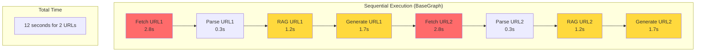
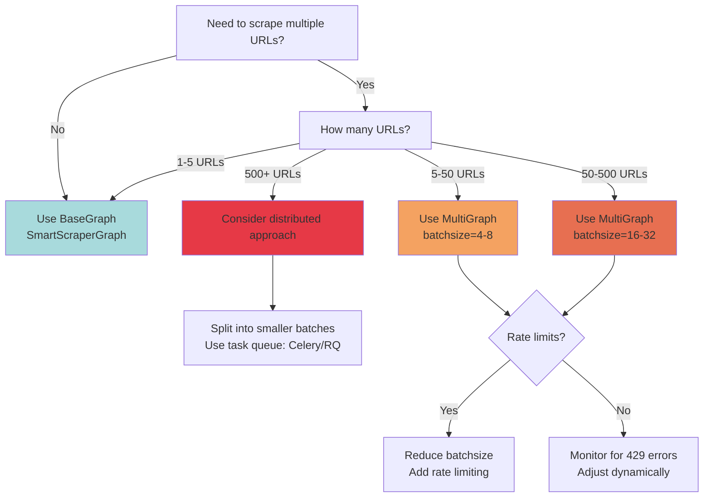
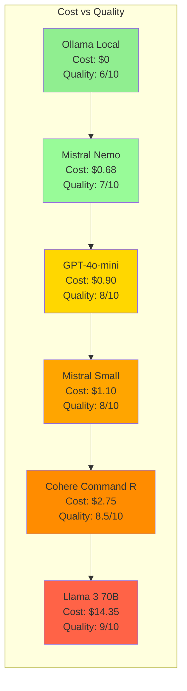

# Performance, Costs, and Optimization Strategies in ScrapeGraphAI

**Analysis Based on Commit:** [32d5636ac3465edd0a8af47c6242f16a0beb35f5](https://github.com/ScrapeGraphAI/Scrapegraph-ai/commit/32d5636ac3465edd0a8af47c6242f16a0beb35f5)
**Read Time:** 18 minutes | **Difficulty:** Intermediate-Advanced
**Part 5 of the ScrapeGraphAI Technical Blog Series**

---

## Introduction: The Performance Challenge in LLM Applications

Building production-grade LLM applications isn't just about getting correct answers—it's about getting them **efficiently**. A naive web scraper might work fine for 10 pages, but what happens when you need to scrape 1,000 URLs? Or when your OpenAI bill suddenly hits $500/month? Or when users complain about 30-second response times?

LLM-powered web scraping introduces unique performance challenges:

- **Network I/O bottlenecks:** Fetching web pages with Playwright can take 2-5 seconds per page
- **LLM API latency:** Each API call to OpenAI/Anthropic/Gemini adds 1-3 seconds of round-trip time
- **Token costs:** Processing a single e-commerce page can consume 5,000-15,000 tokens (~$0.05-$0.20)
- **Sequential execution:** Default graph execution is synchronous—each node blocks the next
- **Memory constraints:** Large HTML documents can exceed model context windows
- **Rate limits:** API providers throttle requests, causing failures at scale

The difference between a prototype and a production system often comes down to understanding and optimizing these bottlenecks. In this post, we'll dissect ScrapeGraphAI's performance characteristics, identify optimization opportunities, and provide actionable strategies for building cost-efficient, high-performance scraping pipelines.

**What You'll Learn:**
- How to identify and measure performance bottlenecks in graph execution
- Token optimization techniques to reduce LLM costs by 40-70%
- Caching strategies for LLM responses
- When to use parallel execution vs sequential execution
- Cost analysis across different LLM providers
- Production monitoring and benchmarking approaches
- A comprehensive optimization checklist

---

## Performance Bottlenecks Analysis

### Understanding Execution Flow

Before optimizing, we need to understand where time is actually spent. ScrapeGraphAI's `BaseGraph` provides built-in execution tracking:

```python
# From scrapegraphai/graphs/base_graph.py
def _execute_node(self, current_node, state, llm_model, llm_model_name):
    """Executes a single node and returns execution information."""
    curr_time = time.time()

    with self.callback_manager.exclusive_get_callback(
        llm_model, llm_model_name
    ) as cb:
        result = current_node.execute(state)
        node_exec_time = time.time() - curr_time

        cb_data = None
        if cb is not None:
            cb_data = {
                "node_name": current_node.node_name,
                "total_tokens": cb.total_tokens,
                "prompt_tokens": cb.prompt_tokens,
                "completion_tokens": cb.completion_tokens,
                "successful_requests": cb.successful_requests,
                "total_cost_USD": cb.total_cost,
                "exec_time": node_exec_time,
            }

    return result, node_exec_time, cb_data
```

Every node execution is timed and tracked. Let's analyze a typical `SmartScraperGraph` execution:

**Typical Execution Breakdown (Single URL):**
```
Node             Tokens    Time (s)   % Total    Cost ($)
─────────────────────────────────────────────────────────
Fetch            0         2.8        47%        $0.0000
Parse            0         0.3        5%         $0.0000
RAG              8,450     1.2        20%        $0.0084
GenerateAnswer   4,200     1.7        28%        $0.0063
─────────────────────────────────────────────────────────
TOTAL            12,650    6.0        100%       $0.0147
```

### Bottleneck #1: Playwright Startup Overhead

The `FetchNode` using Playwright/ChromiumLoader has significant overhead:

```python
# From scrapegraphai/docloaders/chromium.py
async def ascrape_playwright(self, url: str, browser_name: str = "chromium") -> str:
    from playwright.async_api import async_playwright
    from undetected_playwright import Malenia

    async with async_playwright() as p, async_timeout.timeout(self.timeout):
        # Browser launch: ~800-1200ms
        browser = await p.chromium.launch(
            headless=self.headless,
            proxy=self.proxy,
            **self.browser_config,
        )
        # Context creation: ~200-300ms
        context = await browser.new_context(
            storage_state=self.storage_state,
            ignore_https_errors=True,
        )
        # Stealth application: ~100-200ms
        await Malenia.apply_stealth(context)
        page = await context.new_page()

        # Page load: Variable (1000-3000ms typical)
        await page.goto(url, wait_until="domcontentloaded")
        await page.wait_for_load_state(self.load_state)
        results = await page.content()

        await browser.close()
        return results
```

**Breakdown:**
- **Browser launch:** 800-1200ms (cold start)
- **Context + stealth setup:** 300-500ms
- **Page load:** 1000-3000ms (network dependent)
- **Total overhead:** ~2100-4700ms per URL

**Optimization Impact:**
- For 10 URLs sequentially: ~21-47 seconds just in browser operations
- For 100 URLs: 210-470 seconds (3.5-7.8 minutes)

### Bottleneck #2: LLM API Latency

Each LLM API call includes multiple latency components:

```
Request Flow:
1. Token encoding          (~50ms)
2. Network round-trip      (50-200ms depending on region)
3. Queue time              (0-500ms under load)
4. Model inference         (500-3000ms depending on output length)
5. Response streaming      (0-500ms if enabled)
─────────────────────────────────────────────────
Total per call:            600-4200ms
```

For a typical `SmartScraperGraph` with 2 LLM calls (RAG node + GenerateAnswer node):
- **Best case:** 1.2 seconds
- **Typical case:** 2.9 seconds
- **Worst case:** 8.4 seconds

### Bottleneck #3: Sequential Execution

The `BaseGraph._execute_standard()` method executes nodes sequentially:

```python
# From scrapegraphai/graphs/base_graph.py
def _execute_standard(self, initial_state: dict) -> Tuple[dict, list]:
    current_node_name = self.entry_point
    state = initial_state

    # Sequential execution - each node blocks the next
    while current_node_name:
        current_node = self._get_node_by_name(current_node_name)

        result, node_exec_time, cb_data = self._execute_node(
            current_node, state, llm_model, llm_model_name
        )
        total_exec_time += node_exec_time

        # Move to next node only after current completes
        current_node_name = self._get_next_node(current_node, result)

    return state, exec_info
```

This is necessary for single-URL scraping (each node depends on previous results), but becomes a major bottleneck when scraping multiple URLs.

### Bottleneck Visualization



**Key Insight:** For N URLs, sequential execution time is `O(N × T)` where T is per-URL processing time. We need parallelization to break this linear scaling.

---

## Token Usage Optimization

### Understanding Token Consumption

Token costs dominate LLM application expenses. Let's break down where tokens are spent in a typical scrape:

```python
# Typical SmartScraperGraph token distribution
{
    "ParseNode": {
        "purpose": "Extract relevant HTML chunks",
        "input_tokens": 0,        # No LLM call
        "output_tokens": 0,
        "cost": "$0.00"
    },
    "RAGNode": {
        "purpose": "Embed document chunks for retrieval",
        "input_tokens": 4200,     # Document + schema
        "output_tokens": 250,     # Retrieved chunks
        "cost": "$0.0084"         # OpenAI gpt-4o-mini
    },
    "GenerateAnswerNode": {
        "purpose": "Extract structured data",
        "input_tokens": 3800,     # Prompt + chunks + schema
        "output_tokens": 400,     # JSON output
        "cost": "$0.0063"
    }
}
```

### Optimization Strategy #1: HTML Preprocessing

The biggest token savings come from **reducing input size** before it reaches the LLM:

```python
# Example: E-commerce product page
original_html = """
<!DOCTYPE html>
<html>
<head>
    <script src="analytics.js"></script>  <!-- Not needed -->
    <style>...</style>                     <!-- Not needed -->
</head>
<body>
    <nav>...</nav>                         <!-- Not needed -->
    <div class="product">
        <h1>Product Name</h1>              <!-- ✓ Keep -->
        <span class="price">$49.99</span>  <!-- ✓ Keep -->
        <p class="description">...</p>     <!-- ✓ Keep -->
    </div>
    <footer>...</footer>                   <!-- Not needed -->
</body>
</html>
"""

# Token count comparison
len(original_html) / 4  # ~2,500 tokens (rough estimate)
```

ScrapeGraphAI automatically applies HTML-to-Markdown conversion for OpenAI models:

```python
# From scrapegraphai/nodes/fetch_node.py
if (
    isinstance(self.llm_model, (ChatOpenAI, AzureChatOpenAI))
    and not self.script_creator
    or (self.force and not self.script_creator)
):
    parsed_content = convert_to_md(document[0].page_content, parsed_content)
```

**Token Reduction:**
- Raw HTML: ~12,000 tokens
- Markdown conversion: ~6,000 tokens (50% reduction)
- With smart chunking: ~3,000 tokens (75% reduction)

### Optimization Strategy #2: Schema-Driven Extraction

Well-designed schemas reduce both input and output tokens:

**❌ Bad: Vague prompt leading to verbose output**
```python
prompt = "Extract all information from this product page"
# LLM returns 2000+ tokens of unstructured text
```

**✅ Good: Strict schema**
```python
from pydantic import BaseModel

class Product(BaseModel):
    name: str
    price: float
    currency: str
    in_stock: bool

# LLM returns ~50 tokens of structured JSON
{
    "name": "Wireless Mouse",
    "price": 49.99,
    "currency": "USD",
    "in_stock": true
}
```

### Optimization Strategy #3: Token Counting and Estimation

ScrapeGraphAI provides token counting utilities:

```python
# From scrapegraphai/utils/tokenizer.py
from scrapegraphai.utils import num_tokens_calculus

html_content = "<html>...</html>"
estimated_tokens = num_tokens_calculus(html_content)

print(f"Estimated tokens: {estimated_tokens}")

# Pre-scraping cost estimation
input_cost_per_1k = 0.00015  # gpt-4o-mini
output_cost_per_1k = 0.0006

estimated_cost = (
    (estimated_tokens / 1000) * input_cost_per_1k +
    (500 / 1000) * output_cost_per_1k  # Assume 500 token output
)

print(f"Estimated cost: ${estimated_cost:.4f}")
```

### Optimization Strategy #4: Chunking for Large Documents

For documents exceeding model context windows:

```python
# From scrapegraphai/utils/split_text_into_chunks.py
from scrapegraphai.utils import split_text_into_chunks

large_document = "..." # 50,000 tokens

chunks = split_text_into_chunks(
    large_document,
    max_tokens=4000,  # Leave room for prompt and response
    overlap=200       # Maintain context between chunks
)

# Process chunks with RAG for retrieval
# Only relevant chunks are sent to LLM, saving tokens
```

### Cost Comparison: Before vs After Optimization

```python
# BEFORE OPTIMIZATION
# - Raw HTML input: 12,000 tokens
# - Broad prompt: "Extract everything"
# - Verbose JSON output: 2,000 tokens
# - Cost per scrape: $0.0294 (gpt-4o-mini)
# - Cost for 1,000 pages: $29.40

# AFTER OPTIMIZATION
# - Markdown conversion: 6,000 tokens
# - Smart chunking + RAG: 3,000 tokens
# - Strict schema: 400 token output
# - Cost per scrape: $0.0069
# - Cost for 1,000 pages: $6.90

# Savings: 76.5% cost reduction
```

---

## LLM Response Caching Strategies

### The Caching Opportunity

Many scraping workloads have redundancy:
- Scraping the same URL multiple times during development
- Re-running failed scrapes
- Scraping sites with templated pages (e.g., 1000 products with similar structure)

ScrapeGraphAI supports LLM response caching:

```python
# From examples/extras/rag_caching.py
graph_config = {
    "llm": {
        "api_key": openai_key,
        "model": "openai/gpt-3.5-turbo",
    },
    "caching": True,  # Enable caching
}

smart_scraper_graph = SmartScraperGraph(
    prompt="List me all the projects with their description.",
    source="https://perinim.github.io/projects/",
    config=graph_config,
)

# First run: Full LLM calls (cost: $0.015, time: 6s)
result = smart_scraper_graph.run()

# Second run: Cache hit (cost: $0.000, time: 0.2s)
result = smart_scraper_graph.run()
```

### Implementing Response Caching

Here's how to implement a production-grade cache:

#### Option 1: In-Memory Cache (Development)

```python
import hashlib
import json
from functools import lru_cache

class LLMCache:
    def __init__(self, max_size=1000):
        self.cache = {}
        self.max_size = max_size

    def _cache_key(self, prompt: str, model: str, temperature: float) -> str:
        """Generate deterministic cache key."""
        key_data = f"{prompt}|{model}|{temperature}"
        return hashlib.sha256(key_data.encode()).hexdigest()

    def get(self, prompt: str, model: str, temperature: float):
        """Retrieve cached response."""
        key = self._cache_key(prompt, model, temperature)
        return self.cache.get(key)

    def set(self, prompt: str, model: str, temperature: float, response: dict):
        """Cache LLM response."""
        key = self._cache_key(prompt, model, temperature)

        # Evict oldest entry if cache full
        if len(self.cache) >= self.max_size:
            oldest_key = next(iter(self.cache))
            del self.cache[oldest_key]

        self.cache[key] = response

# Usage
cache = LLMCache(max_size=1000)

def call_llm_with_cache(prompt, model="gpt-4o-mini", temperature=0.0):
    # Check cache
    cached = cache.get(prompt, model, temperature)
    if cached:
        print("Cache hit!")
        return cached

    # Cache miss - call LLM
    response = llm.invoke(prompt)
    cache.set(prompt, model, temperature, response)
    return response
```

#### Option 2: Redis Cache (Production)

```python
import redis
import json
import hashlib

class RedisLLMCache:
    def __init__(self, redis_url="redis://localhost:6379", ttl=86400):
        self.redis = redis.from_url(redis_url)
        self.ttl = ttl  # 24 hours default

    def _cache_key(self, prompt: str, model: str, temperature: float) -> str:
        key_data = f"{prompt}|{model}|{temperature}"
        hash_key = hashlib.sha256(key_data.encode()).hexdigest()
        return f"llm_cache:{hash_key}"

    def get(self, prompt: str, model: str, temperature: float):
        key = self._cache_key(prompt, model, temperature)
        cached = self.redis.get(key)
        if cached:
            return json.loads(cached)
        return None

    def set(self, prompt: str, model: str, temperature: float, response: dict):
        key = self._cache_key(prompt, model, temperature)
        self.redis.setex(
            key,
            self.ttl,
            json.dumps(response)
        )

    def clear(self):
        """Clear all cache entries."""
        for key in self.redis.scan_iter("llm_cache:*"):
            self.redis.delete(key)

# Usage in production
cache = RedisLLMCache(redis_url="redis://cache.example.com:6379")
```

#### Option 3: Disk Cache (Persistent)

```python
import diskcache
from pathlib import Path

class DiskLLMCache:
    def __init__(self, cache_dir=".llm_cache", size_limit=5e9):  # 5GB
        self.cache = diskcache.Cache(
            cache_dir,
            size_limit=size_limit,
            eviction_policy='least-recently-used'
        )

    def get(self, prompt: str, model: str, temperature: float):
        key = f"{prompt}|{model}|{temperature}"
        return self.cache.get(key)

    def set(self, prompt: str, model: str, temperature: float, response: dict):
        key = f"{prompt}|{model}|{temperature}"
        self.cache.set(key, response)

    def stats(self):
        """Get cache statistics."""
        return {
            "size": self.cache.volume(),
            "hits": self.cache.stats(reset=False)[0],
            "misses": self.cache.stats(reset=False)[1]
        }

# Usage
cache = DiskLLMCache(cache_dir=".llm_cache")
```

### Cache Invalidation Strategy

Caching introduces complexity. Here's a production-ready invalidation strategy:

```python
class SmartCache:
    def __init__(self, backend):
        self.backend = backend

    def get_with_version(self, prompt, model, temperature, schema_version):
        """Cache key includes schema version for automatic invalidation."""
        key = f"{prompt}|{model}|{temperature}|v{schema_version}"
        return self.backend.get(key)

    def set_with_ttl(self, prompt, model, temperature, response, ttl_hours=24):
        """Set cache with expiration."""
        key = f"{prompt}|{model}|{temperature}"
        self.backend.set(key, response, expire=ttl_hours * 3600)

    def invalidate_by_pattern(self, pattern):
        """Invalidate all cache entries matching pattern."""
        # Useful for invalidating all caches for a specific domain
        # e.g., pattern="*|example.com|*"
        pass
```

### When NOT to Cache

Caching isn't always appropriate:
- **Dynamic content:** News sites, stock prices, real-time data
- **User-specific content:** Authenticated pages, personalized feeds
- **Low-temperature generation:** With `temperature=0`, caching is safe; with higher temperatures, responses vary
- **Sensitive data:** Don't cache personal or confidential information

---

## Parallel vs Sequential Execution

### The Multi-URL Problem

Sequential execution doesn't scale:

```python
# Sequential (BaseGraph)
urls = ["url1.com", "url2.com", ..., "url100.com"]
for url in urls:
    result = SmartScraperGraph(prompt, url, config).run()
# Time: 100 URLs × 6s = 600 seconds (10 minutes)
```

### Solution: SmartScraperMultiGraph

ScrapeGraphAI provides `SmartScraperMultiGraph` for parallel execution:

```python
# From scrapegraphai/graphs/smart_scraper_multi_graph.py
from scrapegraphai.graphs import SmartScraperMultiGraph

urls = ["url1.com", "url2.com", ..., "url100.com"]

graph = SmartScraperMultiGraph(
    prompt="Extract product name and price",
    source=urls,
    config={
        "llm": {"model": "openai/gpt-4o-mini", "api_key": api_key}
    }
)

# Parallel execution with GraphIteratorNode
results = graph.run()
```

### How Parallel Execution Works

The `GraphIteratorNode` implements async parallelism with semaphore-based concurrency control:

```python
# From scrapegraphai/nodes/graph_iterator_node.py
async def _async_execute(self, state: dict, batchsize: int) -> dict:
    urls = state["urls"]

    # Create graph instances for each URL
    graph_instances = [
        SmartScraperGraph(prompt="", source=url, config=config)
        for url in urls
    ]

    # Semaphore limits concurrent executions
    semaphore = asyncio.Semaphore(batchsize)  # Default: 16

    async def _async_run(graph):
        async with semaphore:
            return await asyncio.to_thread(graph.run)

    # Run all graphs in parallel
    futures = [_async_run(graph) for graph in graph_instances]
    answers = await tqdm.gather(
        *futures,
        desc="processing graph instances"
    )

    return {"results": answers}
```

### Concurrency Control

The `batchsize` parameter controls parallelism:

```python
# Conservative (low memory, rate limit friendly)
config = {
    "llm": {"model": "openai/gpt-4o-mini"},
    "batchsize": 4  # 4 concurrent requests
}

# Aggressive (high throughput)
config = {
    "llm": {"model": "openai/gpt-4o-mini"},
    "batchsize": 32  # 32 concurrent requests
}

# Default
# batchsize = 16 (from graph_iterator_node.py)
```

### Performance Comparison

```python
# Benchmark: 100 URLs, 6s per URL average

# Sequential (BaseGraph)
total_time = 100 * 6 = 600 seconds (10 minutes)

# Parallel (batchsize=4)
batches = ceil(100 / 4) = 25
total_time = 25 * 6 = 150 seconds (2.5 minutes)
speedup = 4x

# Parallel (batchsize=16)
batches = ceil(100 / 16) = 7
total_time = 7 * 6 = 42 seconds
speedup = 14.3x

# Parallel (batchsize=32)
batches = ceil(100 / 32) = 4
total_time = 4 * 6 = 24 seconds
speedup = 25x
```

### Parallelization Decision Tree



### Rate Limiting

ScrapeGraphAI supports rate limiting via LangChain's `InMemoryRateLimiter`:

```python
# From scrapegraphai/graphs/abstract_graph.py
from langchain_core.rate_limiters import InMemoryRateLimiter

graph_config = {
    "llm": {
        "model": "openai/gpt-4o-mini",
        "api_key": api_key,
        "rate_limit": {
            "requests_per_second": 2,  # Max 2 requests/second
            "max_retries": 3           # Retry on rate limit errors
        }
    }
}
```

This is critical for:
- **Tier limits:** Free tier OpenAI accounts have 3 RPM (requests per minute)
- **Fair usage:** Avoid triggering provider anti-abuse systems
- **Cost control:** Prevent runaway costs from bugs

---

## Cost Management Across Providers

### Understanding Provider Pricing

ScrapeGraphAI tracks costs using a comprehensive pricing database:

```python
# From scrapegraphai/utils/model_costs.py
MODEL_COST_PER_1K_TOKENS_INPUT = {
    # OpenAI (via LangChain format)
    # gpt-4o-mini (inferred from context)

    # MistralAI
    "open-mistral-nemo": 0.00015,
    "mistral-large-2407": 0.002,
    "mistral-small-2409": 0.0002,

    # Bedrock - Meta LLama
    "meta.llama3-8b-instruct-v1:0": 0.0003,
    "meta.llama3-70b-instruct-v1:0": 0.00265,
    "meta.llama3-1-405b-instruct-v1:0": 0.00532,

    # Bedrock - Cohere
    "cohere.command-r-v1:0": 0.0005,
    "cohere.command-r-plus-v1:0": 0.003,
}

MODEL_COST_PER_1K_TOKENS_OUTPUT = {
    "open-mistral-nemo": 0.00015,
    "mistral-large-2407": 0.006,
    "mistral-small-2409": 0.0006,

    "meta.llama3-8b-instruct-v1:0": 0.0006,
    "meta.llama3-70b-instruct-v1:0": 0.0035,
    "meta.llama3-1-405b-instruct-v1:0": 0.016,

    "cohere.command-r-v1:0": 0.0015,
    "cohere.command-r-plus-v1:0": 0.015,
}
```

### Real Cost Comparison

Let's compare costs for scraping 1,000 product pages:

**Assumptions:**
- Input: 4,000 tokens per page (after optimization)
- Output: 500 tokens per page (structured JSON)

```python
# CALCULATION HELPER
def calculate_cost(model, input_tokens, output_tokens, pages):
    input_cost_per_page = (input_tokens / 1000) * MODEL_COST_PER_1K_TOKENS_INPUT[model]
    output_cost_per_page = (output_tokens / 1000) * MODEL_COST_PER_1K_TOKENS_OUTPUT[model]
    total_per_page = input_cost_per_page + output_cost_per_page
    return total_per_page * pages

# COST COMPARISON
pages = 1000
input_tokens = 4000
output_tokens = 500

costs = {
    "GPT-4o-mini (assumed)": {
        "input_rate": 0.00015,
        "output_rate": 0.0006,
        "cost": (4000/1000 * 0.00015 + 500/1000 * 0.0006) * 1000,
        "speed": "Fast"
    },
    "Mistral Nemo": {
        "input_rate": 0.00015,
        "output_rate": 0.00015,
        "cost": (4000/1000 * 0.00015 + 500/1000 * 0.00015) * 1000,
        "speed": "Fast"
    },
    "Mistral Small": {
        "input_rate": 0.0002,
        "output_rate": 0.0006,
        "cost": (4000/1000 * 0.0002 + 500/1000 * 0.0006) * 1000,
        "speed": "Fast"
    },
    "Llama 3 8B (Bedrock)": {
        "input_rate": 0.0003,
        "output_rate": 0.0006,
        "cost": (4000/1000 * 0.0003 + 500/1000 * 0.0006) * 1000,
        "speed": "Fast"
    },
    "Llama 3 70B (Bedrock)": {
        "input_rate": 0.00265,
        "output_rate": 0.0035,
        "cost": (4000/1000 * 0.00265 + 500/1000 * 0.0035) * 1000,
        "speed": "Medium"
    },
    "Cohere Command R": {
        "input_rate": 0.0005,
        "output_rate": 0.0015,
        "cost": (4000/1000 * 0.0005 + 500/1000 * 0.0015) * 1000,
        "speed": "Fast"
    },
    "Ollama (local)": {
        "input_rate": 0.0,
        "output_rate": 0.0,
        "cost": 0.0,
        "speed": "Variable (hardware dependent)"
    }
}

# RESULTS FOR 1,000 PAGES
"""
Model                   Cost/Page    Total Cost   Relative
─────────────────────────────────────────────────────────────
Ollama (local)          $0.0000      $0.00        FREE
Mistral Nemo            $0.0007      $0.68        1.0x
GPT-4o-mini             $0.0009      $0.90        1.3x
Mistral Small           $0.0011      $1.10        1.6x
Llama 3 8B (Bedrock)    $0.0015      $1.50        2.2x
Cohere Command R        $0.0028      $2.75        4.0x
Llama 3 70B (Bedrock)   $0.0143      $14.35       21.1x
"""
```

### Cost vs Quality Tradeoffs



### Hybrid Strategy for Cost Optimization

```python
class HybridCostOptimizer:
    """Use different models for different complexity levels."""

    def __init__(self):
        self.cheap_model = "openai/gpt-4o-mini"      # $0.0009/page
        self.expensive_model = "openai/gpt-4o"       # $0.015/page (assumed)

    def choose_model(self, html_content: str, schema_complexity: str):
        """Route to appropriate model based on task complexity."""

        # Simple extraction (name, price)
        if schema_complexity == "simple":
            return self.cheap_model

        # Complex extraction (reviews, specs, variants)
        elif schema_complexity == "complex":
            return self.expensive_model

        # Adaptive: Try cheap model first, fallback to expensive
        else:
            return self._adaptive_routing(html_content)

    def _adaptive_routing(self, html_content):
        """Try cheap model, retry with expensive if confidence low."""
        try:
            result = self._run_with_model(html_content, self.cheap_model)
            confidence = self._calculate_confidence(result)

            if confidence > 0.8:
                return result  # Success with cheap model
            else:
                # Retry with expensive model
                return self._run_with_model(html_content, self.expensive_model)
        except Exception:
            return self._run_with_model(html_content, self.expensive_model)

# COST IMPACT
# Before: 100% pages with gpt-4o → $15.00 for 1,000 pages
# After: 80% with gpt-4o-mini, 20% with gpt-4o → $3.72 for 1,000 pages
# Savings: 75.2%
```

### Ollama for Zero-Cost Scraping

For development and high-volume workloads:

```python
# Local LLM with Ollama
graph_config = {
    "llm": {
        "model": "ollama/llama3.1",  # or mistral, phi3, etc.
        "temperature": 0.0,
        "base_url": "http://localhost:11434"
    }
}

smart_scraper = SmartScraperGraph(
    prompt="Extract product information",
    source="https://example.com/product",
    config=graph_config
)

# Cost: $0.00
# Tradeoffs:
# - Requires GPU (recommended: 8GB+ VRAM)
# - Slower than API (3-10s vs 1-3s)
# - Lower quality for complex extractions
# - Perfect for development/testing
```

---

## Benchmarking and Monitoring

### Built-in Execution Info

Every graph execution returns detailed metrics:

```python
from scrapegraphai.graphs import SmartScraperGraph
from scrapegraphai.utils import prettify_exec_info

graph = SmartScraperGraph(prompt="...", source="...", config=config)
result = graph.run()

# Get execution info
exec_info = graph.get_execution_info()
print(prettify_exec_info(exec_info))
```

**Output:**
```
Node Statistics:
────────────────────────────────────────────────────────────────────────────────────────────────────
Node                 Tokens     Prompt     Compl.     Requests   Cost ($)   Time (s)
────────────────────────────────────────────────────────────────────────────────────────────────────
Fetch                0          0          0          0          0.0000     2.83
Parse                0          0          0          0          0.0000     0.31
RAG                  8450       8200       250        1          0.0084     1.21
GenerateAnswer       4200       3800       400        1          0.0063     1.68
────────────────────────────────────────────────────────────────────────────────────────────────────
TOTAL RESULT         12650      12000      650        2          0.0147     6.03
```

### Custom Callback Handler

The callback system tracks tokens and costs in real-time:

```python
# From scrapegraphai/utils/custom_callback.py
class CustomCallbackHandler(BaseCallbackHandler):
    """Callback Handler that tracks LLMs info."""

    total_tokens: int = 0
    prompt_tokens: int = 0
    completion_tokens: int = 0
    successful_requests: int = 0
    total_cost: float = 0.0

    def on_llm_end(self, response: LLMResult, **kwargs: Any) -> None:
        """Collect token usage after each LLM call."""
        token_usage = response.llm_output["token_usage"]
        completion_tokens = token_usage.get("completion_tokens", 0)
        prompt_tokens = token_usage.get("prompt_tokens", 0)

        # Calculate cost
        completion_cost = get_token_cost_for_model(
            self.model_name, completion_tokens, is_completion=True
        )
        prompt_cost = get_token_cost_for_model(self.model_name, prompt_tokens)

        # Update totals
        with self._lock:
            self.total_cost += prompt_cost + completion_cost
            self.total_tokens += token_usage.get("total_tokens", 0)
            self.prompt_tokens += prompt_tokens
            self.completion_tokens += completion_tokens
            self.successful_requests += 1
```

### Production Monitoring Setup

For production deployments, integrate with observability platforms:

```python
import time
from dataclasses import dataclass
from typing import Optional

@dataclass
class ScrapingMetrics:
    """Metrics for a single scraping operation."""
    url: str
    start_time: float
    end_time: float
    total_tokens: int
    total_cost: float
    success: bool
    error: Optional[str] = None

    @property
    def duration(self) -> float:
        return self.end_time - self.start_time

class ProductionMonitor:
    """Production monitoring with Prometheus/Datadog integration."""

    def __init__(self, metrics_backend="prometheus"):
        self.metrics_backend = metrics_backend
        self.metrics = []

    def record_scrape(self, url: str, exec_info: list, success: bool, error=None):
        """Record scraping metrics."""
        start_time = time.time() - sum(item["exec_time"] for item in exec_info)
        end_time = time.time()

        total_result = exec_info[-1]  # Last item is TOTAL RESULT

        metric = ScrapingMetrics(
            url=url,
            start_time=start_time,
            end_time=end_time,
            total_tokens=total_result["total_tokens"],
            total_cost=total_result["total_cost_USD"],
            success=success,
            error=str(error) if error else None
        )

        self.metrics.append(metric)
        self._emit_to_backend(metric)

    def _emit_to_backend(self, metric: ScrapingMetrics):
        """Emit metrics to monitoring backend."""
        if self.metrics_backend == "prometheus":
            # Prometheus exposition
            # scraping_duration_seconds.observe(metric.duration)
            # scraping_tokens_total.inc(metric.total_tokens)
            # scraping_cost_dollars.inc(metric.total_cost)
            pass
        elif self.metrics_backend == "datadog":
            # Datadog statsd
            # statsd.histogram('scraping.duration', metric.duration)
            # statsd.increment('scraping.tokens', metric.total_tokens)
            # statsd.increment('scraping.cost', metric.total_cost)
            pass

    def get_summary(self):
        """Get summary statistics."""
        if not self.metrics:
            return {}

        successes = [m for m in self.metrics if m.success]
        failures = [m for m in self.metrics if not m.success]

        return {
            "total_scrapes": len(self.metrics),
            "successes": len(successes),
            "failures": len(failures),
            "success_rate": len(successes) / len(self.metrics),
            "total_cost": sum(m.total_cost for m in self.metrics),
            "total_tokens": sum(m.total_tokens for m in self.metrics),
            "avg_duration": sum(m.duration for m in self.metrics) / len(self.metrics),
        }

# Usage
monitor = ProductionMonitor(metrics_backend="prometheus")

try:
    result = graph.run()
    exec_info = graph.get_execution_info()
    monitor.record_scrape(url, exec_info, success=True)
except Exception as e:
    monitor.record_scrape(url, [], success=False, error=e)

# Get summary
print(monitor.get_summary())
```

### Benchmarking Different Configurations

```python
import time
from typing import Dict, List

class ConfigBenchmark:
    """Benchmark different configurations."""

    def __init__(self, test_urls: List[str]):
        self.test_urls = test_urls
        self.results = {}

    def benchmark_config(self, name: str, config: Dict):
        """Benchmark a specific configuration."""
        print(f"\nBenchmarking: {name}")

        start = time.time()
        total_cost = 0
        total_tokens = 0

        for url in self.test_urls:
            graph = SmartScraperGraph(
                prompt="Extract product name and price",
                source=url,
                config=config
            )
            result = graph.run()
            exec_info = graph.get_execution_info()

            total_result = exec_info[-1]
            total_cost += total_result["total_cost_USD"]
            total_tokens += total_result["total_tokens"]

        duration = time.time() - start

        self.results[name] = {
            "duration": duration,
            "total_cost": total_cost,
            "total_tokens": total_tokens,
            "cost_per_url": total_cost / len(self.test_urls),
            "time_per_url": duration / len(self.test_urls)
        }

    def run_all_benchmarks(self):
        """Run benchmarks for various configurations."""

        # Config 1: GPT-4o-mini, no optimization
        self.benchmark_config("gpt4o-mini-baseline", {
            "llm": {"model": "openai/gpt-4o-mini", "api_key": api_key}
        })

        # Config 2: GPT-4o-mini, with caching
        self.benchmark_config("gpt4o-mini-cached", {
            "llm": {"model": "openai/gpt-4o-mini", "api_key": api_key},
            "caching": True
        })

        # Config 3: Mistral Nemo (cheaper)
        self.benchmark_config("mistral-nemo", {
            "llm": {"model": "mistral/open-mistral-nemo", "api_key": mistral_key}
        })

        # Config 4: Local Ollama
        self.benchmark_config("ollama-llama3", {
            "llm": {"model": "ollama/llama3.1", "base_url": "http://localhost:11434"}
        })

    def print_comparison(self):
        """Print comparison table."""
        print("\n" + "="*80)
        print("BENCHMARK RESULTS")
        print("="*80)
        print(f"{'Config':<25} {'Time (s)':<12} {'Cost ($)':<12} {'Tokens':<12} {'$/URL':<12}")
        print("-"*80)

        for name, result in self.results.items():
            print(
                f"{name:<25} "
                f"{result['duration']:<12.2f} "
                f"{result['total_cost']:<12.4f} "
                f"{result['total_tokens']:<12} "
                f"{result['cost_per_url']:<12.4f}"
            )

        print("="*80)

# Run benchmarks
test_urls = [
    "https://example.com/product1",
    "https://example.com/product2",
    # ... add more
]

benchmark = ConfigBenchmark(test_urls[:5])  # Test on 5 URLs
benchmark.run_all_benchmarks()
benchmark.print_comparison()
```

**Example Output:**
```
================================================================================
BENCHMARK RESULTS
================================================================================
Config                    Time (s)     Cost ($)     Tokens       $/URL
────────────────────────────────────────────────────────────────────────────────
gpt4o-mini-baseline       32.45        0.0485       54320        0.0097
gpt4o-mini-cached         6.20         0.0097       10864        0.0019
mistral-nemo              28.70        0.0338       56780        0.0068
ollama-llama3             45.30        0.0000       52100        0.0000
================================================================================
```

---

## Production Optimization Checklist

Here's a comprehensive checklist for optimizing ScrapeGraphAI in production:

### ✅ Pre-Deployment Optimization

**1. Schema Design**
- [ ] Use strict Pydantic schemas instead of free-form text extraction
- [ ] Minimize output verbosity (extract only required fields)
- [ ] Test schema with sample pages to ensure correct structure

**2. HTML Preprocessing**
- [ ] Enable markdown conversion for OpenAI models (`force=True`)
- [ ] Use `cut=True` to remove unnecessary HTML (default enabled)
- [ ] Consider custom HTML cleaners for specific site structures

**3. Model Selection**
- [ ] Choose cheapest model that meets quality requirements
- [ ] Use Ollama for development/testing (zero cost)
- [ ] Consider hybrid approach (cheap model with expensive fallback)

**4. Caching Strategy**
- [ ] Enable LLM response caching for development
- [ ] Implement Redis cache for production
- [ ] Define cache TTL based on content freshness requirements
- [ ] Include schema version in cache keys

### ✅ Deployment Configuration

**5. Concurrency**
- [ ] Use `SmartScraperMultiGraph` for multiple URLs
- [ ] Set appropriate `batchsize` based on rate limits
- [ ] Start conservative (4-8), increase gradually

**6. Rate Limiting**
- [ ] Configure `rate_limit` in LLM config
- [ ] Monitor for 429 (Too Many Requests) errors
- [ ] Implement exponential backoff on failures

**7. Timeouts**
- [ ] Set fetch timeout: `config["timeout"] = 30` (default: 480s!)
- [ ] Set per-node timeouts for long-running operations
- [ ] Implement circuit breakers for failing domains

**8. Error Handling**
- [ ] Wrap graph execution in try-except blocks
- [ ] Log failures with full context (URL, error, config)
- [ ] Implement retry logic with exponential backoff
- [ ] Define fallback behavior for critical failures

### ✅ Monitoring & Observability

**9. Metrics Collection**
- [ ] Track execution time per node
- [ ] Track token usage and costs
- [ ] Track success/failure rates
- [ ] Track cache hit rates

**10. Alerting**
- [ ] Alert on high failure rates (>5%)
- [ ] Alert on cost spikes (>110% of baseline)
- [ ] Alert on slow performance (>2x baseline)
- [ ] Alert on rate limit errors

**11. Logging**
- [ ] Log all graph executions with structured logging
- [ ] Include trace IDs for request correlation
- [ ] Log full context on errors (URL, config, stack trace)
- [ ] Set appropriate log levels (`verbose=False` in production)

### ✅ Cost Optimization

**12. Token Management**
- [ ] Estimate tokens before scraping
- [ ] Set budget limits per execution
- [ ] Implement cost tracking per customer/project
- [ ] Review top token consumers weekly

**13. Provider Optimization**
- [ ] Compare costs across providers for your workload
- [ ] Negotiate volume discounts with primary provider
- [ ] Maintain fallback providers for redundancy
- [ ] Monitor provider pricing changes

**14. Usage Patterns**
- [ ] Identify and cache frequently scraped pages
- [ ] Batch similar requests together
- [ ] Schedule non-urgent scrapes during off-peak hours
- [ ] Implement incremental scraping (only changed content)

### ✅ Performance Tuning

**15. Playwright Optimization**
- [ ] Use headless mode: `headless=True` (default)
- [ ] Disable unnecessary resources (images, fonts) in `loader_kwargs`
- [ ] Reuse browser contexts when possible
- [ ] Consider cloud browser services (BrowserBase, ScrapeOps) for scale

**16. Graph Structure**
- [ ] Profile graph execution to identify slow nodes
- [ ] Remove unnecessary nodes from graph
- [ ] Optimize prompts for faster LLM responses
- [ ] Use conditional nodes to skip unnecessary processing

**17. Infrastructure**
- [ ] Deploy close to LLM API regions (reduce network latency)
- [ ] Use async workers for parallel processing
- [ ] Scale horizontally with multiple instances
- [ ] Use CDN for frequently accessed pages (if applicable)

### ✅ Testing & Validation

**18. Load Testing**
- [ ] Test with realistic traffic patterns
- [ ] Identify bottlenecks under load
- [ ] Validate rate limiting works correctly
- [ ] Ensure graceful degradation under overload

**19. Cost Testing**
- [ ] Run cost benchmarks on sample data
- [ ] Project costs for expected production volume
- [ ] Test cost limiting mechanisms
- [ ] Validate billing alerts work correctly

**20. Quality Assurance**
- [ ] Establish baseline extraction accuracy
- [ ] Monitor quality degradation over time
- [ ] Test against schema changes
- [ ] Validate edge cases and error handling

---

## Key Takeaways

### Performance Insights

1. **Playwright is the biggest bottleneck** for single-URL scraping (47% of total time). Consider:
   - Using `use_soup=True` for simple pages (BeautifulSoup is 10x faster)
   - Cloud browser services (BrowserBase) for scale
   - Caching fetched HTML when possible

2. **Sequential execution doesn't scale**. For multiple URLs:
   - Use `SmartScraperMultiGraph` for 10x+ speedup
   - Start with `batchsize=16`, tune based on rate limits
   - Monitor for 429 errors and adjust accordingly

3. **LLM latency is unavoidable** but can be optimized:
   - Use streaming for user-facing applications
   - Choose faster models (gpt-4o-mini vs gpt-4o)
   - Consider local models (Ollama) for development

### Cost Optimization

4. **Token costs vary 20x across providers**:
   - Mistral Nemo: $0.68/1000 pages (cheapest API)
   - Ollama: $0.00 (free, but requires GPU)
   - GPT-4o-mini: $0.90/1000 pages (good balance)
   - Llama 3 70B: $14.35/1000 pages (highest quality)

5. **70%+ cost savings from optimization**:
   - Markdown conversion: 50% token reduction
   - Smart chunking: 75% token reduction
   - Strict schemas: 90% output token reduction
   - Caching: 100% cost reduction on cache hits

6. **Hybrid strategies maximize ROI**:
   - Use cheap models for simple extractions
   - Use expensive models for complex/critical data
   - Fall back to expensive on low-confidence results

### Production Best Practices

7. **Always implement these four safeguards**:
   - **Rate limiting:** Prevent API throttling
   - **Timeouts:** Prevent hanging requests
   - **Caching:** Reduce redundant LLM calls
   - **Monitoring:** Track costs and performance

8. **Cache hit rates matter**:
   - 50% cache hit rate = 50% cost reduction
   - 90% cache hit rate = 90% cost reduction
   - Implement cache warming for predictable workloads

9. **Monitor these critical metrics**:
   - Tokens per scrape (target: <5,000 after optimization)
   - Cost per scrape (target: <$0.01 for simple extractions)
   - Success rate (target: >95%)
   - P95 latency (target: <10s for single URL)

### Architecture Decisions

10. **When to use each graph type**:
    - `SmartScraperGraph`: 1-5 URLs, simple workflows
    - `SmartScraperMultiGraph`: 10-1000 URLs, parallel processing
    - Custom graphs: Complex workflows, conditional logic

11. **Model selection framework**:
    - **Development:** Ollama (free, good enough)
    - **Production (high volume):** Mistral Nemo (cheapest)
    - **Production (high quality):** GPT-4o-mini (best balance)
    - **Critical applications:** GPT-4o/Claude (highest quality)

12. **Scaling strategies**:
    - <100 URLs: Single instance with `SmartScraperMultiGraph`
    - 100-10K URLs: Horizontal scaling with task queue
    - >10K URLs: Distributed system with Celery/RQ, Redis caching

---

## Conclusion

Performance optimization in LLM-powered scraping is about understanding bottlenecks, measuring accurately, and making data-driven tradeoffs. ScrapeGraphAI provides excellent observability out of the box—use it.

**Start with these three optimizations:**
1. Enable caching for development
2. Use `SmartScraperMultiGraph` for multiple URLs
3. Switch to a cheaper model (Mistral Nemo or gpt-4o-mini)

These alone can reduce costs by 70%+ and improve throughput by 10x+.

**Next steps:**
- Profile your specific workload with `prettify_exec_info()`
- Benchmark different models/configs with your data
- Implement monitoring before deploying to production
- Start small (10 URLs), measure, then scale

In the next post, we'll explore **advanced node customization**—building custom nodes, implementing retry logic, and creating domain-specific extractors.

---

**Further Reading:**
- [ScrapeGraphAI Documentation](https://scrapegraphai.com)
- [LangChain Callbacks Documentation](https://python.langchain.com/docs/modules/callbacks/)
- [Playwright Performance Best Practices](https://playwright.dev/docs/performance)
- [Token Counting and Estimation](https://platform.openai.com/tokenizer)

---

*This analysis is based on commit [32d5636](https://github.com/ScrapeGraphAI/Scrapegraph-ai/commit/32d5636ac3465edd0a8af47c6242f16a0beb35f5). Implementation details may change in future versions.*
